# GitFluent - Complete User Flow Documentation

A comprehensive guide to all user journeys and interactions within the GitFluent language learning application.

## 📱 App Overview

**GitFluent** is a freemium language learning app with two main user types:

- **Free Users**: Access to flashcards, vocabulary management, and basic features
- **Premium Users**: Full AI chat functionality plus all free features

## 🎯 Core User Flows

### **Flow Index:**

1. [Onboarding & Authentication](#1-onboarding--authentication-flow)
2. [Free User Experience](#2-free-user-experience-flow)
3. [Premium User Experience](#3-premium-user-experience-flow)
4. [AI Chat & Vocabulary Learning](#4-ai-chat--vocabulary-learning-flow)
5. [Flashcard Study Session](#5-flashcard-study-session-flow)
6. [Vocabulary Management](#6-vocabulary-management-flow)
7. [Settings & Configuration](#7-settings--configuration-flow)
8. [Premium Upgrade](#8-premium-upgrade-flow)
9. [Error Handling & Edge Cases](#9-error-handling--edge-cases)

---

## 1. Onboarding & Authentication Flow

### **1.1 First App Launch**

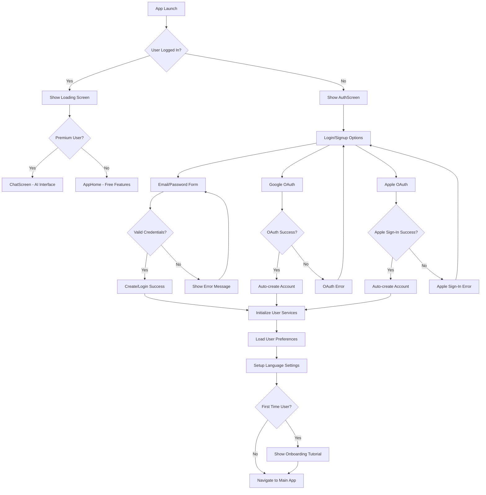
```mermaid
flowchart TD
    A[App Launch] --> B{User Logged In?}
    B -->|No| C[Show AuthScreen]
    B -->|Yes| D[Show Loading Screen]
    D --> E{Premium User?}
    E -->|Yes| F[ChatScreen - AI Interface]
    E -->|No| G[AppHome - Free Features]

    C --> H[Login/Signup Options]
    H --> I[Email/Password Form]
    H --> J[Google OAuth]
    H --> K[Apple OAuth]

    I --> L{Valid Credentials?}
    L -->|Yes| M[Create/Login Success]
    L -->|No| N[Show Error Message]
    N --> I

    J --> O{OAuth Success?}
    O -->|Yes| P[Auto-create Account]
    O -->|No| Q[OAuth Error]
    Q --> H

    K --> R{Apple Sign-In Success?}
    R -->|Yes| S[Auto-create Account]
    R -->|No| T[Apple Sign-In Error]
    T --> H

    M --> U[Initialize User Services]
    P --> U
    S --> U
    U --> V[Load User Preferences]
    V --> W[Setup Language Settings]
    W --> X{First Time User?}
    X -->|Yes| Y[Show Onboarding Tutorial]
    X -->|No| Z[Navigate to Main App]
    Y --> Z
```

#### **Detailed Steps:**

**Step 1: App Initialization**

- App loads and checks authentication state
- Shows loading screen with app logo
- Initializes core services (Supabase, debug helper)

**Step 2: Authentication Check**

- `UserService` checks for existing session
- If logged in → proceed to main app
- If not logged in → show `AuthScreen`

**Step 3: Authentication Options**

```
AuthScreen Layout:
┌─────────────────────────────────┐
│         GitFluent Logo          │
│    Learn Languages with AI      │
├─────────────────────────────────┤
│  📧 Email/Password Login        │
│  🔵 Continue with Google        │
│  🍎 Continue with Apple         │
├─────────────────────────────────┤
│  Don't have an account?         │
│  → Sign Up                      │
└─────────────────────────────────┘
```

**Step 4: Account Creation Process**

- **Email/Password**: Form validation, password strength check
- **OAuth**: Redirect to provider, handle callback, auto-create profile
- **Profile Setup**: First name, last name, optional profile picture

**Step 5: Initial Setup**

- Load user preferences from database
- Initialize language settings (target/native languages)
- Check premium status
- Show onboarding tutorial for new users

---

## 2. Free User Experience Flow

### **2.1 Free User Home Screen**

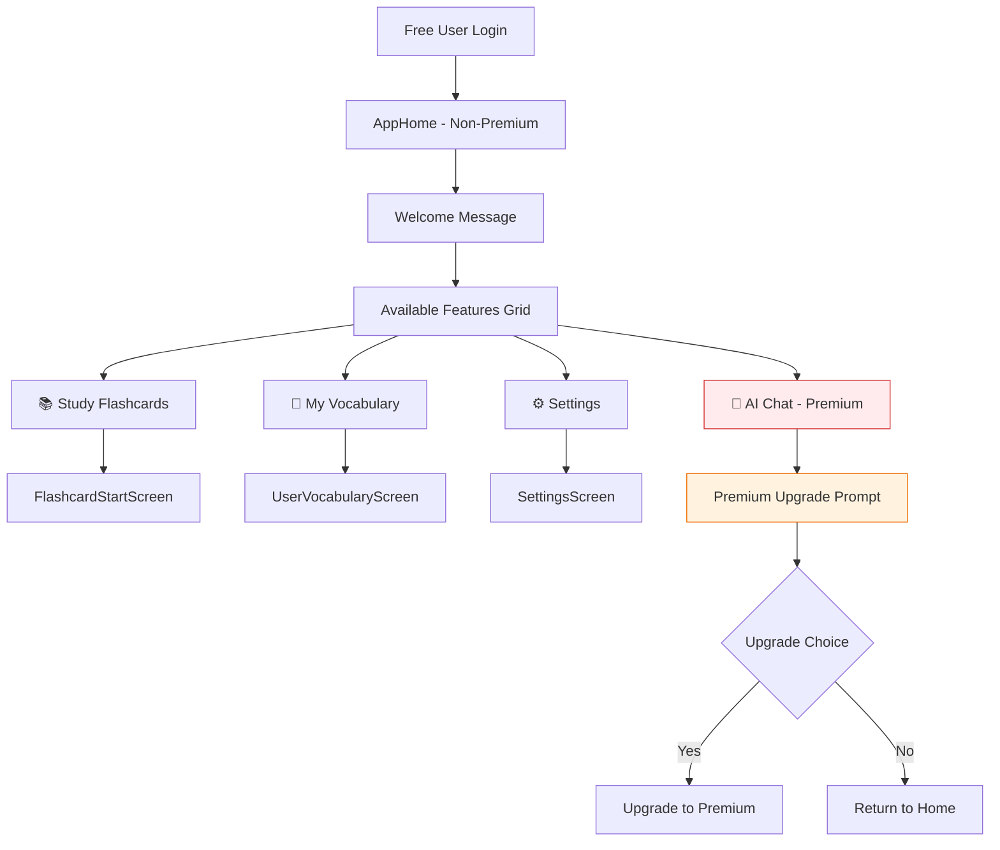
```mermaid
flowchart TD
    A[Free User Login] --> B[AppHome - Non-Premium]
    B --> C[Welcome Message]
    C --> D[Available Features Grid]

    D --> E[📚 Study Flashcards]
    D --> F[📖 My Vocabulary]
    D --> G[⚙️ Settings]
    D --> H[💬 AI Chat - Premium]

    E --> I[FlashcardStartScreen]
    F --> J[UserVocabularyScreen]
    G --> K[SettingsScreen]
    H --> L[Premium Upgrade Prompt]

    L --> M{Upgrade Choice}
    M -->|Yes| N[Upgrade to Premium]
    M -->|No| O[Return to Home]

    style H fill:#ffebee,stroke:#d32f2f
    style L fill:#fff3e0,stroke:#ef6c00
```

#### **Free User Interface Layout:**

```
Free User Home Screen:
┌─────────────────────────────────┐
│  Welcome, [User Name]!     🔓   │
│                                 │
│  Available Features:            │
│  ┌─────────┐ ┌─────────┐       │
│  │   📚    │ │   📖    │       │
│  │ Study   │ │   My    │       │
│  │Flashcrd │ │ Vocab   │       │
│  └─────────┘ └─────────┘       │
│  ┌─────────┐ ┌─────────┐       │
│  │   ⚙️    │ │   💬⭐  │       │
│  │Settings │ │AI Chat  │       │
│  │         │ │Premium  │       │
│  └─────────┘ └─────────┘       │
│                                 │
│  🌟 Upgrade to Premium          │
│  Unlock AI-powered features!    │
│  [Upgrade Now]                  │
└─────────────────────────────────┘
```

### **2.2 Free User Feature Access**

**Available Features:**

- ✅ **Flashcard Study**: Full access to spaced repetition system
- ✅ **Vocabulary Management**: View, edit, and organize words
- ✅ **Settings**: Configure app preferences and languages
- ✅ **Progress Tracking**: Basic study statistics

**Restricted Features:**

- ❌ **AI Chat**: Requires premium upgrade
- ❌ **Advanced Analytics**: Premium-only detailed insights
- ❌ **Vocabulary Extraction**: No automatic word extraction from conversations

---

## 3. Premium User Experience Flow

### **3.1 Premium User Interface**

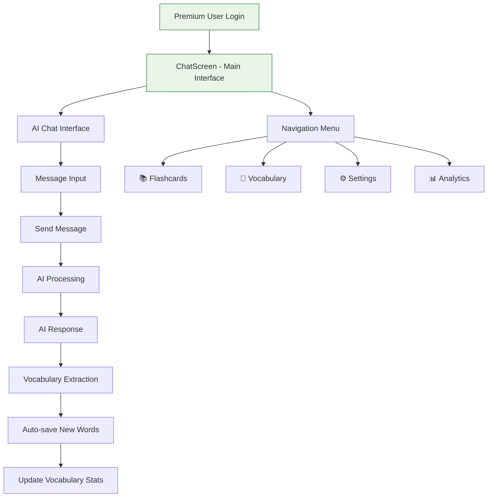
```mermaid
flowchart TD
    A[Premium User Login] --> B[ChatScreen - Main Interface]
    B --> C[AI Chat Interface]
    C --> D[Message Input]
    D --> E[Send Message]
    E --> F[AI Processing]
    F --> G[AI Response]
    G --> H[Vocabulary Extraction]
    H --> I[Auto-save New Words]
    I --> J[Update Vocabulary Stats]

    B --> K[Navigation Menu]
    K --> L[📚 Flashcards]
    K --> M[📖 Vocabulary]
    K --> N[⚙️ Settings]
    K --> O[📊 Analytics]

    style A fill:#e8f5e8,stroke:#2e7d32
    style B fill:#e8f5e8,stroke:#2e7d32
```

#### **Premium User Interface Layout:**

```
Premium Chat Screen:
┌─────────────────────────────────┐
│  GitFluent        ⭐Premium [≡] │
├─────────────────────────────────┤
│                                 │
│  🤖 AI: Ciao! Come stai oggi?   │
│                                 │
│  👤 You: Sto bene, grazie!      │
│                                 │
│  🤖 AI: Perfetto! Vuoi          │
│      praticare il vocabolario?  │
│                                 │
│  📝 +3 new words added          │
│     • praticare (practice)      │
│     • vocabolario (vocabulary)  │
│     • perfetto (perfect)        │
│                                 │
├─────────────────────────────────┤
│ Type your message... [🎤] [📎] │
└─────────────────────────────────┘

Navigation Menu:
┌─────────────────┐
│ 📚 Flashcards   │
│ 📖 Vocabulary   │
│ 📊 Analytics    │
│ ⚙️ Settings     │
│ 🚪 Sign Out     │
└─────────────────┘
```

---

## 4. AI Chat & Vocabulary Learning Flow

### **4.1 AI Conversation Cycle**

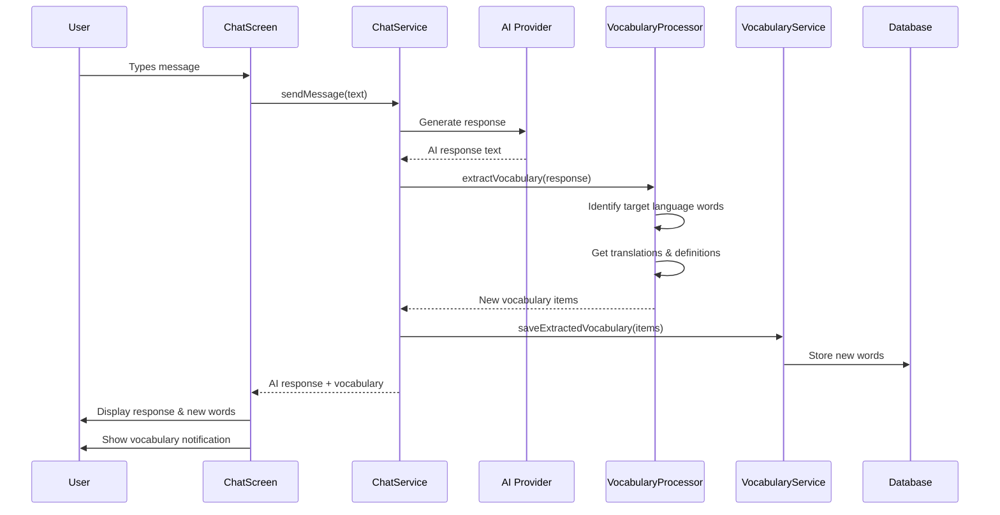
```mermaid
sequenceDiagram
    participant U as User
    participant C as ChatScreen
    participant CS as ChatService
    participant AI as AI Provider
    participant VP as VocabularyProcessor
    participant VS as VocabularyService
    participant DB as Database

    U->>C: Types message
    C->>CS: sendMessage(text)
    CS->>AI: Generate response
    AI-->>CS: AI response text
    CS->>VP: extractVocabulary(response)
    VP->>VP: Identify target language words
    VP->>VP: Get translations & definitions
    VP-->>CS: New vocabulary items
    CS->>VS: saveExtractedVocabulary(items)
    VS->>DB: Store new words
    CS-->>C: AI response + vocabulary
    C->>U: Display response & new words
    C->>U: Show vocabulary notification
```

#### **Detailed Conversation Flow:**

**Step 1: User Input**

```
User types: "Mi piace molto la pizza italiana"
```

**Step 2: AI Processing**

- Message sent to selected AI provider (OpenAI/Gemini)
- AI generates contextual response in target language
- Response includes corrections, encouragement, follow-up questions

**Step 3: Vocabulary Extraction**

```dart
// Automatic vocabulary detection
Extracted words:
- "piace" (to like) - verb
- "molto" (very) - adverb
- "pizza" (pizza) - noun
- "italiana" (Italian) - adjective
```

**Step 4: Auto-save to Vocabulary**

- New words automatically added to user's vocabulary collection
- Difficulty estimated based on word frequency and complexity
- Initial mastery level set to 0 (new word)
- Review scheduled for next day

**Step 5: User Notification**

```
📝 New vocabulary added:
• piace (to like)
• molto (very)
• italiana (Italian)

[Study Now] [View Vocabulary]
```

### **4.2 Chat Interface Features**

**Real-time Features:**

- ⌨️ **Live typing indicator** while AI generates response
- 📝 **Auto-vocabulary extraction** from every AI message
- 🔄 **Message history** persisted across sessions
- 🎯 **Context awareness** for coherent conversations
- 🌍 **Language-specific prompts** based on user settings

**Interactive Elements:**

```
Chat Message Layout:
┌─────────────────────────────────┐
│ 🤖 AI: Che cosa fai nel tempo   │
│       libero?                   │
│                                 │
│ [🔊 Listen] [📋 Copy] [⭐ Save] │
│                                 │
│ 📝 New words:                   │
│ • tempo (time) - noun           │
│ • libero (free) - adjective     │
│ [+ Add to Flashcards]           │
└─────────────────────────────────┘
```

---

## 5. Flashcard Study Session Flow

### **5.1 Study Session Configuration**

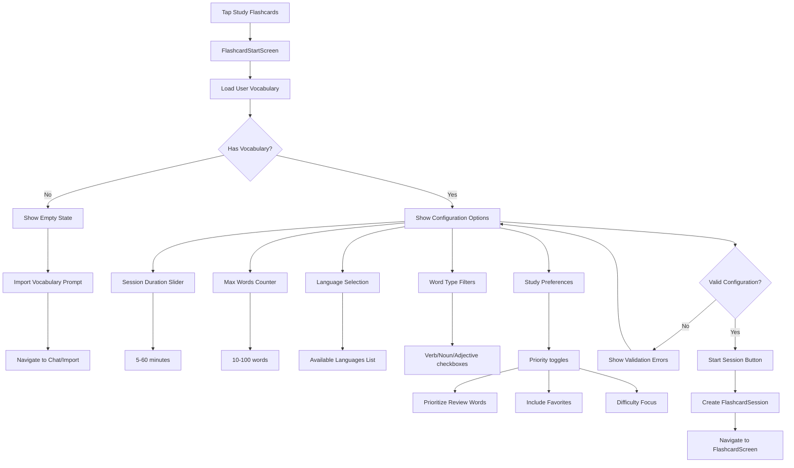
```mermaid
flowchart TD
    A[Tap Study Flashcards] --> B[FlashcardStartScreen]
    B --> C[Load User Vocabulary]
    C --> D{Has Vocabulary?}
    D -->|No| E[Show Empty State]
    D -->|Yes| F[Show Configuration Options]

    E --> G[Import Vocabulary Prompt]
    G --> H[Navigate to Chat/Import]

    F --> I[Session Duration Slider]
    F --> J[Max Words Counter]
    F --> K[Language Selection]
    F --> L[Word Type Filters]
    F --> M[Study Preferences]

    I --> N[5-60 minutes]
    J --> O[10-100 words]
    K --> P[Available Languages List]
    L --> Q[Verb/Noun/Adjective checkboxes]
    M --> R[Priority toggles]

    R --> S[Prioritize Review Words]
    R --> T[Include Favorites]
    R --> U[Difficulty Focus]

    F --> V{Valid Configuration?}
    V -->|No| W[Show Validation Errors]
    V -->|Yes| X[Start Session Button]
    W --> F
    X --> Y[Create FlashcardSession]
    Y --> Z[Navigate to FlashcardScreen]
```

#### **Configuration Screen Layout:**

```
Flashcard Configuration:
┌─────────────────────────────────┐
│ Study Flashcards           [X]  │
├─────────────────────────────────┤
│ 📊 Vocabulary Status            │
│ Total words: 247                │
│ Due for review: 23              │
│ New words: 15                   │
├─────────────────────────────────┤
│ ⏱️ Session Duration             │
│ ●────●────────────── 15 min     │
│                                 │
│ 🎯 Max Words: 25                │
│ ●──────●──────────── [25]       │
│                                 │
│ 🌍 Language: Italian            │
│ [Italian ▼]                     │
│                                 │
│ 📝 Word Types:                  │
│ ☑️ Verbs    ☑️ Nouns            │
│ ☑️ Adjectives ☐ Adverbs         │
│                                 │
│ 🎛️ Preferences:                 │
│ ☑️ Prioritize review words      │
│ ☑️ Include favorites            │
│ ☐ Focus on difficult words     │
├─────────────────────────────────┤
│        [Start Session]          │
└─────────────────────────────────┘
```

### **5.2 Active Study Session**

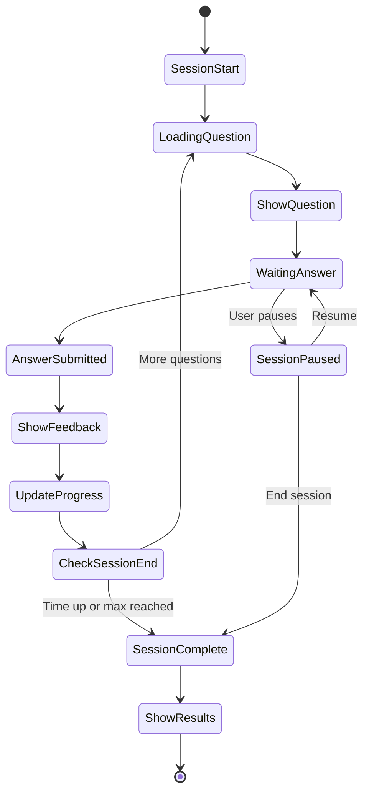
```mermaid
stateDiagram-v2
    [*] --> SessionStart
    SessionStart --> LoadingQuestion
    LoadingQuestion --> ShowQuestion
    ShowQuestion --> WaitingAnswer
    WaitingAnswer --> AnswerSubmitted
    AnswerSubmitted --> ShowFeedback
    ShowFeedback --> UpdateProgress
    UpdateProgress --> CheckSessionEnd
    CheckSessionEnd --> LoadingQuestion: More questions
    CheckSessionEnd --> SessionComplete: Time up or max reached
    SessionComplete --> ShowResults
    ShowResults --> [*]

    WaitingAnswer --> SessionPaused: User pauses
    SessionPaused --> WaitingAnswer: Resume
    SessionPaused --> SessionComplete: End session
```

#### **Question Types & Interface:**

**1. Traditional Flashcard (Word → Translation)**

```
Traditional Question:
┌─────────────────────────────────┐
│ Question 5 of 25        ⏱️ 2:30 │
├─────────────────────────────────┤
│                                 │
│           🇮🇹                   │
│                                 │
│         mangiare                │
│                                 │
│    What does this mean?         │
│                                 │
│ ┌─────────────────────────────┐ │
│ │ Type your answer...         │ │
│ └─────────────────────────────┘ │
│                                 │
│ [Skip] [Hint] [Submit Answer]   │
│                                 │
│ Progress: ████████░░ 80%        │
└─────────────────────────────────┘
```

**2. Multiple Choice**

```
Multiple Choice Question:
┌─────────────────────────────────┐
│ Question 12 of 25       ⏱️ 1:45 │
├─────────────────────────────────┤
│                                 │
│ What does "veloce" mean?        │
│                                 │
│ A) 🐌 Slow                      │
│ B) 🏃 Fast                      │
│ C) 🚗 Car                       │
│ D) 🏠 House                     │
│                                 │
│ [Select your answer]            │
│                                 │
│ Progress: ████████████░ 90%     │
└─────────────────────────────────┘
```

**3. Fill in the Blank**

```
Fill in the Blank:
┌─────────────────────────────────┐
│ Question 18 of 25       ⏱️ 1:15 │
├─────────────────────────────────┤
│                                 │
│ Complete the sentence:          │
│                                 │
│ "Oggi _____ molto caldo"        │
│ (Today is very hot)             │
│                                 │
│ ┌─────────────────────────────┐ │
│ │ Type the missing word...    │ │
│ └─────────────────────────────┘ │
│                                 │
│ [Submit] [Show Hint]            │
│                                 │
│ Progress: ██████████████░ 95%   │
└─────────────────────────────────┘
```

### **5.3 Answer Feedback System**

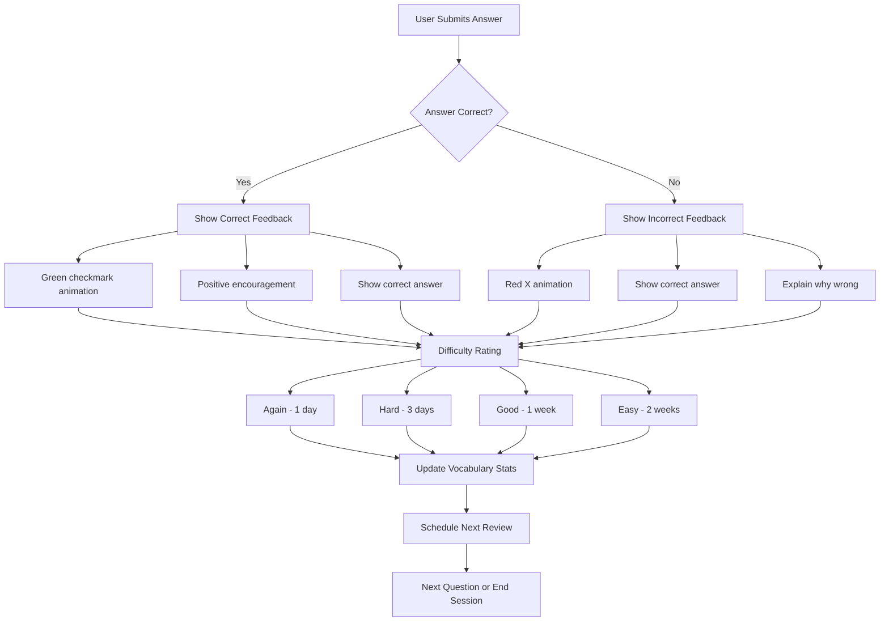
```mermaid
flowchart TD
    A[User Submits Answer] --> B{Answer Correct?}
    B -->|Yes| C[Show Correct Feedback]
    B -->|No| D[Show Incorrect Feedback]

    C --> E[Green checkmark animation]
    C --> F[Positive encouragement]
    C --> G[Show correct answer]

    D --> H[Red X animation]
    D --> I[Show correct answer]
    D --> J[Explain why wrong]

    E --> K[Difficulty Rating]
    F --> K
    G --> K
    H --> K
    I --> K
    J --> K

    K --> L[Again - 1 day]
    K --> M[Hard - 3 days]
    K --> N[Good - 1 week]
    K --> O[Easy - 2 weeks]

    L --> P[Update Vocabulary Stats]
    M --> P
    N --> P
    O --> P

    P --> Q[Schedule Next Review]
    Q --> R[Next Question or End Session]
```

#### **Feedback Interface Examples:**

**Correct Answer:**

```
Correct Feedback:
┌─────────────────────────────────┐
│         ✅ Correct!             │
│                                 │
│ mangiare = to eat               │
│                                 │
│ Great job! You're learning      │
│ Italian verbs quickly! 🎉       │
│                                 │
│ How difficult was this?         │
│                                 │
│ [Again] [Hard] [Good] [Easy]    │
│                                 │
│         [Continue →]            │
└─────────────────────────────────┘
```

**Incorrect Answer:**

```
Incorrect Feedback:
┌─────────────────────────────────┐
│         ❌ Not quite            │
│                                 │
│ You answered: "to drink"        │
│ Correct answer: "to eat"        │
│                                 │
│ 💡 Tip: "mangiare" is related   │
│    to "manger" in French       │
│                                 │
│ Don't worry, you'll get it!     │
│                                 │
│         [Continue →]            │
└─────────────────────────────────┘
```

### **5.4 Session Completion & Results**

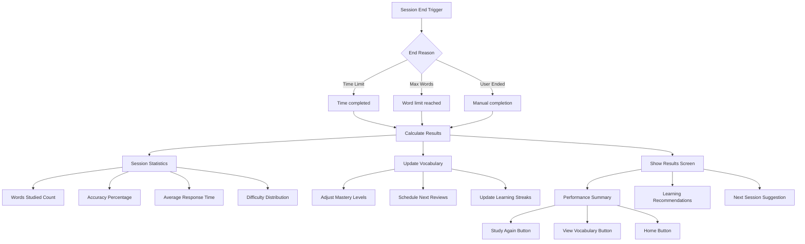
```mermaid
flowchart TD
    A[Session End Trigger] --> B{End Reason}
    B -->|Time Limit| C[Time completed]
    B -->|Max Words| D[Word limit reached]
    B -->|User Ended| E[Manual completion]

    C --> F[Calculate Results]
    D --> F
    E --> F

    F --> G[Session Statistics]
    G --> H[Words Studied Count]
    G --> I[Accuracy Percentage]
    G --> J[Average Response Time]
    G --> K[Difficulty Distribution]

    F --> L[Update Vocabulary]
    L --> M[Adjust Mastery Levels]
    L --> N[Schedule Next Reviews]
    L --> O[Update Learning Streaks]

    F --> P[Show Results Screen]
    P --> Q[Performance Summary]
    P --> R[Learning Recommendations]
    P --> S[Next Session Suggestion]

    Q --> T[Study Again Button]
    Q --> U[View Vocabulary Button]
    Q --> V[Home Button]
```

#### **Results Screen Layout:**

```
Session Results:
┌─────────────────────────────────┐
│ 🎉 Session Complete!            │
├─────────────────────────────────┤
│ 📊 Your Performance:            │
│                                 │
│ ⏱️ Time: 15:00 / 15:00          │
│ 📝 Words Studied: 25            │
│ ✅ Accuracy: 84% (21/25)        │
│ ⚡ Avg Response: 3.2s           │
│                                 │
│ 📈 Difficulty Breakdown:        │
│ Easy: ████████░░ 8              │
│ Good: ██████░░░░ 6              │
│ Hard: ████░░░░░░ 4              │
│ Again: ██░░░░░░░░ 2             │
│                                 │
│ 🎯 Next Review:                 │
│ • 12 words tomorrow             │
│ • 8 words next week             │
│ • 3 words next month            │
│                                 │
│ 💡 Recommendation:              │
│ Great progress! Focus on verbs  │
│ in your next session.           │
├─────────────────────────────────┤
│ [Study Again] [View Vocabulary] │
│           [Home]                │
└─────────────────────────────────┘
```

---

## 6. Vocabulary Management Flow

### **6.1 Vocabulary Collection Overview**

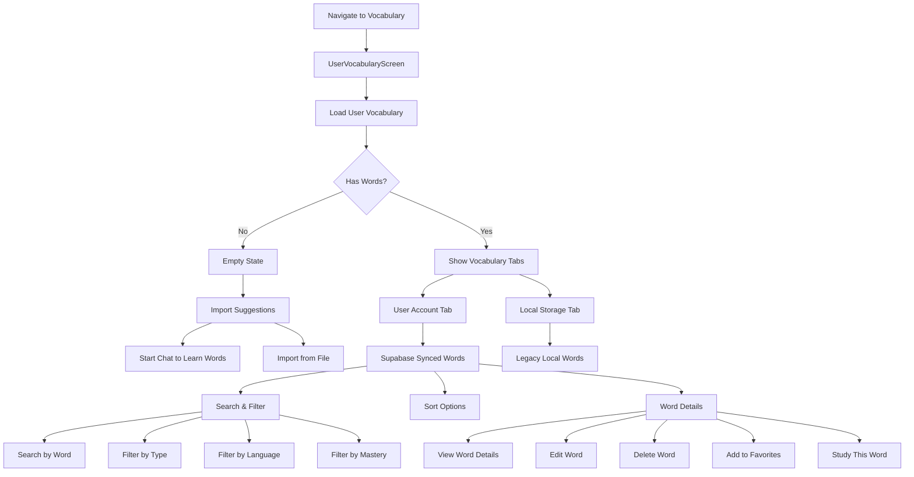
```mermaid
flowchart TD
    A[Navigate to Vocabulary] --> B[UserVocabularyScreen]
    B --> C[Load User Vocabulary]
    C --> D{Has Words?}
    D -->|No| E[Empty State]
    D -->|Yes| F[Show Vocabulary Tabs]

    E --> G[Import Suggestions]
    G --> H[Start Chat to Learn Words]
    G --> I[Import from File]

    F --> J[User Account Tab]
    F --> K[Local Storage Tab]

    J --> L[Supabase Synced Words]
    K --> M[Legacy Local Words]

    L --> N[Search & Filter]
    L --> O[Sort Options]
    L --> P[Word Details]

    N --> Q[Search by Word]
    N --> R[Filter by Type]
    N --> S[Filter by Language]
    N --> T[Filter by Mastery]

    P --> U[View Word Details]
    P --> V[Edit Word]
    P --> W[Delete Word]
    P --> X[Add to Favorites]
    P --> Y[Study This Word]
```

#### **Vocabulary Screen Layout:**

```
My Vocabulary:
┌─────────────────────────────────┐
│ My Vocabulary     🔄📚[≡]       │
├─────────────────────────────────┤
│ User Account (247) | Local (12) │
├─────────────────────────────────┤
│ 🔍 Search: [mangiare________]   │
│                                 │
│ Filters: [All Types ▼] [All ▼] │
│ Sort: [Recent ▼]               │
├─────────────────────────────────┤
│ 📝 mangiare (to eat)           │
│ Verb • Mastery: 75% • Due: 2d   │
│ ⭐ [Study] [Edit] [❤️]          │
├─────────────────────────────────┤
│ 🏠 casa (house)                │
│ Noun • Mastery: 90% • Mastered  │
│ [Study] [Edit] [💙]            │
├─────────────────────────────────┤
│ ⚡ veloce (fast)               │
│ Adj • Mastery: 45% • Due: 1d    │
│ [Study] [Edit] [🤍]            │
├─────────────────────────────────┤
│ 📊 Statistics: 247 total        │
│ 🎯 23 due for review            │
│ ⭐ 189 mastered                 │
└─────────────────────────────────┘
```

### **6.2 Word Detail & Management**

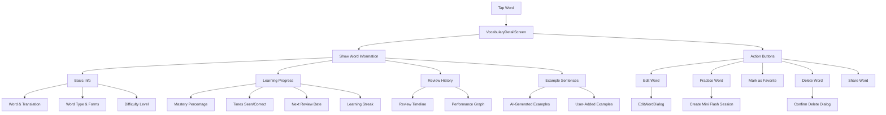
```mermaid
flowchart TD
    A[Tap Word] --> B[VocabularyDetailScreen]
    B --> C[Show Word Information]
    C --> D[Basic Info]
    C --> E[Learning Progress]
    C --> F[Review History]
    C --> G[Example Sentences]

    D --> H[Word & Translation]
    D --> I[Word Type & Forms]
    D --> J[Difficulty Level]

    E --> K[Mastery Percentage]
    E --> L[Times Seen/Correct]
    E --> M[Next Review Date]
    E --> N[Learning Streak]

    F --> O[Review Timeline]
    F --> P[Performance Graph]

    G --> Q[AI-Generated Examples]
    G --> R[User-Added Examples]

    B --> S[Action Buttons]
    S --> T[Edit Word]
    S --> U[Practice Word]
    S --> V[Mark as Favorite]
    S --> W[Delete Word]
    S --> X[Share Word]

    T --> Y[EditWordDialog]
    U --> Z[Create Mini Flash Session]
    W --> AA[Confirm Delete Dialog]
```

#### **Word Detail View:**

```
Word Details: "mangiare"
┌─────────────────────────────────┐
│ ← mangiare                [⭐]  │
├─────────────────────────────────┤
│ 🇮🇹 Italian Verb                │
│ 🇺🇸 to eat                      │
│                                 │
│ 📊 Learning Progress:           │
│ Mastery: ████████░░ 75%         │
│ Seen: 12 times                  │
│ Correct: 9 times (75%)          │
│ Next review: in 3 days          │
│ Learning streak: 5 days         │
│                                 │
│ 📝 Word Forms:                  │
│ • mangio (I eat)                │
│ • mangi (you eat)               │
│ • mangia (he/she eats)          │
│                                 │
│ 💬 Example Sentences:           │
│ • "Mangio la pizza"             │
│   (I eat pizza)                 │
│ • "Cosa mangi?" (What do you eat?) │
│                                 │
│ 📈 Performance Graph:           │
│ ████░░ ██████░ ████████         │
│ Week 1  Week 2   Week 3         │
├─────────────────────────────────┤
│ [Edit] [Practice] [Delete]      │
└─────────────────────────────────┘
```

### **6.3 Import & Export Functions**

**Import Sources:**

- 📱 **From Chat**: Automatically extracted during AI conversations
- 📄 **CSV Import**: Upload vocabulary files
- 🔄 **Sync from Cloud**: Merge with existing vocabulary
- 📝 **Manual Entry**: Add words individually

**Export Options:**

- 💾 **CSV Export**: Download vocabulary for external use
- 📤 **Share Collection**: Share with other users
- ☁️ **Backup to Cloud**: Ensure data safety

---

## 7. Settings & Configuration Flow

### **7.1 Settings Navigation**

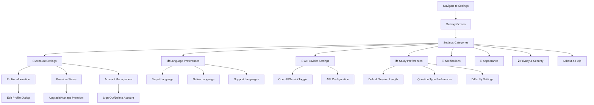
```mermaid
flowchart TD
    A[Navigate to Settings] --> B[SettingsScreen]
    B --> C[Settings Categories]

    C --> D[👤 Account Settings]
    C --> E[🌍 Language Preferences]
    C --> F[🤖 AI Provider Settings]
    C --> G[📚 Study Preferences]
    C --> H[🔔 Notifications]
    C --> I[🎨 Appearance]
    C --> J[🔒 Privacy & Security]
    C --> K[ℹ️ About & Help]

    D --> L[Profile Information]
    D --> M[Premium Status]
    D --> N[Account Management]

    E --> O[Target Language]
    E --> P[Native Language]
    E --> Q[Support Languages]

    F --> R[OpenAI/Gemini Toggle]
    F --> S[API Configuration]

    G --> T[Default Session Length]
    G --> U[Question Type Preferences]
    G --> V[Difficulty Settings]

    L --> W[Edit Profile Dialog]
    M --> X[Upgrade/Manage Premium]
    N --> Y[Sign Out/Delete Account]
```

#### **Settings Screen Layout:**

```
Settings:
┌─────────────────────────────────┐
│ ← Settings                      │
├─────────────────────────────────┤
│ 👤 Account                      │
│ John Doe • Premium ⭐           │
│ john@example.com                │
│ [Edit Profile] [Manage Premium] │
├─────────────────────────────────┤
│ 🌍 Languages                    │
│ Learning: Italian 🇮🇹           │
│ Native: English 🇺🇸             │
│ [Change Languages]              │
├─────────────────────────────────┤
│ 🤖 AI Provider                  │
│ Current: Gemini                 │
│ ○ OpenAI  ● Gemini             │
├─────────────────────────────────┤
│ 📚 Study Preferences            │
│ Default session: 15 minutes     │
│ Max words per session: 25       │
│ Question types: All enabled     │
│ [Configure Study Settings]      │
├─────────────────────────────────┤
│ 🔔 Notifications                │
│ Daily reminders: ON             │
│ Study streaks: ON               │
│ New vocabulary: ON              │
├─────────────────────────────────┤
│ 🎨 Appearance                   │
│ Theme: System                   │
│ ○ Light  ○ Dark  ● System      │
├─────────────────────────────────┤
│ 🔒 Privacy & Security           │
│ Data backup: Enabled            │
│ [Privacy Policy] [Terms]        │
├─────────────────────────────────┤
│ [Sign Out] [Delete Account]     │
└─────────────────────────────────┘
```

### **7.2 Language Configuration**

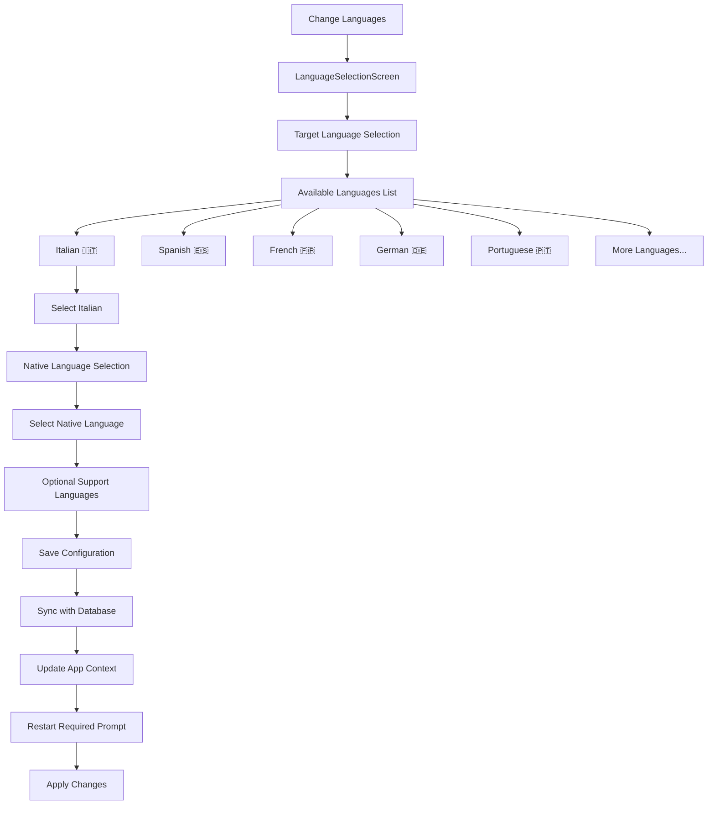
```mermaid
flowchart TD
    A[Change Languages] --> B[LanguageSelectionScreen]
    B --> C[Target Language Selection]
    C --> D[Available Languages List]
    D --> E[Italian 🇮🇹]
    D --> F[Spanish 🇪🇸]
    D --> G[French 🇫🇷]
    D --> H[German 🇩🇪]
    D --> I[Portuguese 🇵🇹]
    D --> J[More Languages...]

    E --> K[Select Italian]
    K --> L[Native Language Selection]
    L --> M[Select Native Language]
    M --> N[Optional Support Languages]
    N --> O[Save Configuration]
    O --> P[Sync with Database]
    P --> Q[Update App Context]
    Q --> R[Restart Required Prompt]
    R --> S[Apply Changes]
```

#### **Language Selection Interface:**

```
Language Settings:
┌─────────────────────────────────┐
│ ← Language Preferences          │
├─────────────────────────────────┤
│ 🎯 What language are you        │
│    learning?                    │
│                                 │
│ ● 🇮🇹 Italian                   │
│ ○ 🇪🇸 Spanish                   │
│ ○ 🇫🇷 French                    │
│ ○ 🇩🇪 German                    │
│ ○ 🇵🇹 Portuguese                │
│ ○ More languages...             │
├─────────────────────────────────┤
│ 🏠 What's your native           │
│    language?                    │
│                                 │
│ ● 🇺🇸 English                   │
│ ○ 🇪🇸 Spanish                   │
│ ○ 🇫🇷 French                    │
│ ○ Other...                      │
├─────────────────────────────────┤
│ 🤝 Support languages (optional) │
│                                 │
│ 1st: [Select Language ▼]       │
│ 2nd: [Select Language ▼]       │
├─────────────────────────────────┤
│         [Save Changes]          │
└─────────────────────────────────┘
```

---

## 8. Premium Upgrade Flow

### **8.1 Upgrade Triggers & Entry Points**

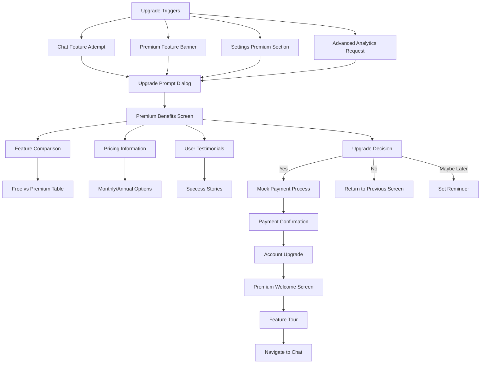
```mermaid
flowchart TD
    A[Upgrade Triggers] --> B[Chat Feature Attempt]
    A --> C[Premium Feature Banner]
    A --> D[Settings Premium Section]
    A --> E[Advanced Analytics Request]

    B --> F[Upgrade Prompt Dialog]
    C --> F
    D --> F
    E --> F

    F --> G[Premium Benefits Screen]
    G --> H[Feature Comparison]
    G --> I[Pricing Information]
    G --> J[User Testimonials]

    H --> K[Free vs Premium Table]
    I --> L[Monthly/Annual Options]
    J --> M[Success Stories]

    G --> N[Upgrade Decision]
    N -->|Yes| O[Mock Payment Process]
    N -->|No| P[Return to Previous Screen]
    N -->|Maybe Later| Q[Set Reminder]

    O --> R[Payment Confirmation]
    R --> S[Account Upgrade]
    S --> T[Premium Welcome Screen]
    T --> U[Feature Tour]
    U --> V[Navigate to Chat]
```

#### **Upgrade Prompt Examples:**

**Chat Feature Attempt:**

```
Premium Required:
┌─────────────────────────────────┐
│         🤖💬 AI Chat            │
│                                 │
│ Unlock intelligent conversation │
│ features with premium access!   │
│                                 │
│ ✨ Premium Benefits:            │
│ • Unlimited AI conversations    │
│ • Automatic vocabulary learning │
│ • Advanced progress analytics   │
│ • Priority customer support     │
│                                 │
│ 🎯 Perfect for serious language │
│    learners who want to         │
│    accelerate their progress!   │
│                                 │
│ [Upgrade to Premium] [Not Now]  │
└─────────────────────────────────┘
```

**Feature Comparison:**

```
Free vs Premium:
┌─────────────────────────────────┐
│ Feature Comparison              │
├──────────────┬──────────────────┤
│ Feature      │ Free  │ Premium  │
├──────────────┼───────┼──────────┤
│ Flashcards   │  ✅   │    ✅    │
│ Vocabulary   │  ✅   │    ✅    │
│ Basic Stats  │  ✅   │    ✅    │
│ AI Chat      │  ❌   │    ✅    │
│ Auto Extract │  ❌   │    ✅    │
│ Advanced     │  ❌   │    ✅    │
│ Analytics    │       │          │
│ Priority     │  ❌   │    ✅    │
│ Support      │       │          │
├──────────────┴───────┴──────────┤
│ Ready to unlock full potential? │
│                                 │
│ 🏷️ Special Launch Price:        │
│ $4.99/month (reg. $9.99)       │
│                                 │
│         [Upgrade Now]           │
└─────────────────────────────────┘
```

### **8.2 Mock Premium Upgrade Process**

**Note**: This app uses a mock premium system for demonstration purposes.

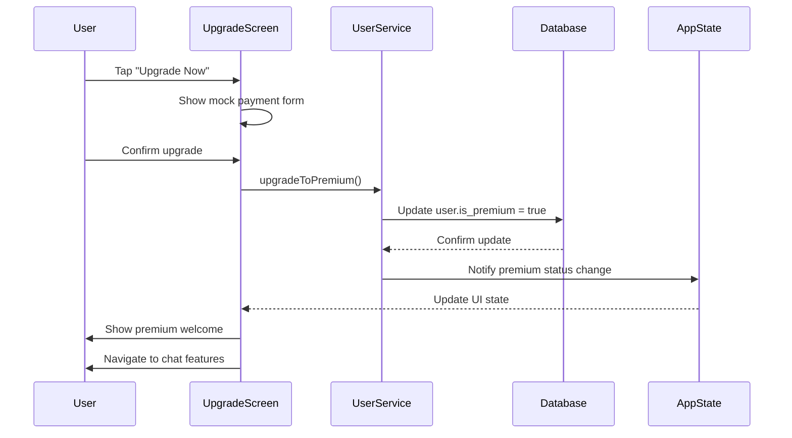
```mermaid
sequenceDiagram
    participant U as User
    participant UI as UpgradeScreen
    participant US as UserService
    participant DB as Database
    participant AS as AppState

    U->>UI: Tap "Upgrade Now"
    UI->>UI: Show mock payment form
    U->>UI: Confirm upgrade
    UI->>US: upgradeToPremium()
    US->>DB: Update user.is_premium = true
    DB-->>US: Confirm update
    US->>AS: Notify premium status change
    AS-->>UI: Update UI state
    UI->>U: Show premium welcome
    UI->>U: Navigate to chat features
```

**Mock Payment Interface:**

```
Premium Upgrade:
┌─────────────────────────────────┐
│ 🌟 Upgrade to Premium           │
├─────────────────────────────────┤
│ 💳 Payment Details              │
│ (Demo Mode - No Real Payment)   │
│                                 │
│ Plan: Monthly Premium           │
│ Price: $4.99/month              │
│                                 │
│ [●] I agree to Terms of Service │
│ [●] I agree to Privacy Policy   │
│                                 │
│ 🔒 Secure Checkout              │
│ ┌─────────────────────────────┐ │
│ │ **** **** **** 1234         │ │
│ │ John Doe            12/25   │ │
│ │ CVV: ***                    │ │
│ └─────────────────────────────┘ │
│                                 │
│ [Complete Upgrade - $4.99]      │
│                                 │
│ 💡 Note: This is a demo app.    │
│    No actual payment will be    │
│    processed.                   │
└─────────────────────────────────┘
```

### **8.3 Premium Welcome & Onboarding**

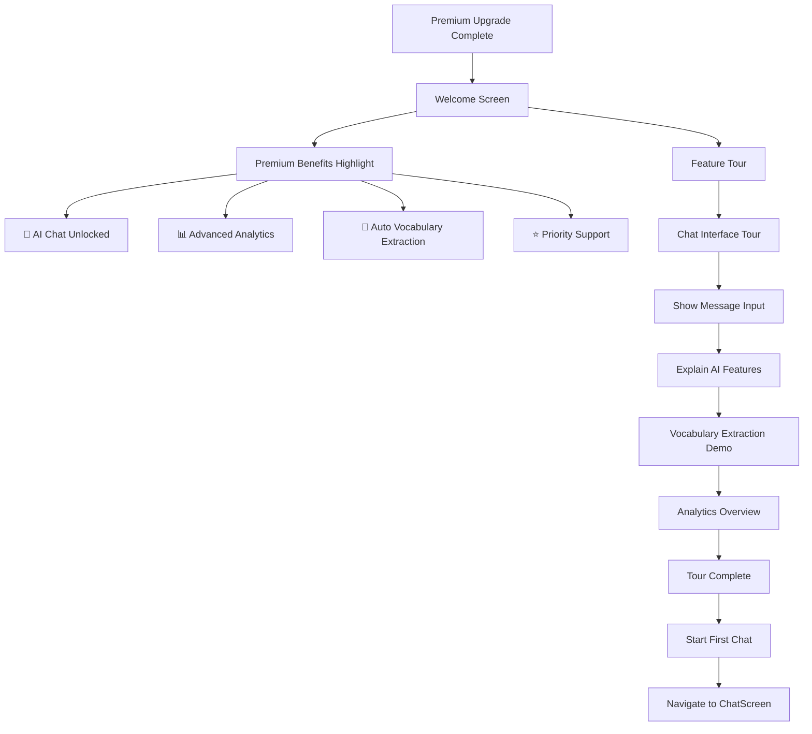
```mermaid
flowchart TD
    A[Premium Upgrade Complete] --> B[Welcome Screen]
    B --> C[Premium Benefits Highlight]
    C --> D[🤖 AI Chat Unlocked]
    C --> E[📊 Advanced Analytics]
    C --> F[🔄 Auto Vocabulary Extraction]
    C --> G[⭐ Priority Support]

    B --> H[Feature Tour]
    H --> I[Chat Interface Tour]
    I --> J[Show Message Input]
    J --> K[Explain AI Features]
    K --> L[Vocabulary Extraction Demo]
    L --> M[Analytics Overview]
    M --> N[Tour Complete]

    N --> O[Start First Chat]
    O --> P[Navigate to ChatScreen]
```

**Premium Welcome Screen:**

```
Welcome to Premium! 🌟
┌─────────────────────────────────┐
│ 🎉 Congratulations!             │
│                                 │
│ You now have access to:         │
│                                 │
│ 🤖 Unlimited AI Conversations   │
│    Practice with intelligent    │
│    language tutors              │
│                                 │
│ 📝 Automatic Vocabulary         │
│    New words extracted and      │
│    saved automatically          │
│                                 │
│ 📊 Advanced Analytics           │
│    Detailed progress tracking   │
│    and learning insights        │
│                                 │
│ ⭐ Priority Support             │
│    Fast help when you need it   │
│                                 │
│ Ready to start learning?        │
│                                 │
│ [Take Feature Tour] [Start Chat]│
└─────────────────────────────────┘
```

---

## 9. Error Handling & Edge Cases

### **9.1 Network & Connectivity Issues**

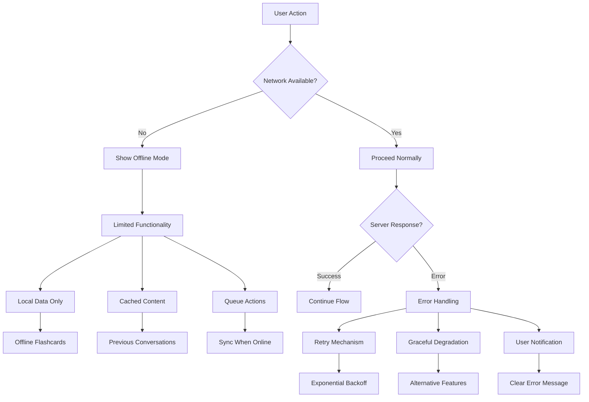
```mermaid
flowchart TD
    A[User Action] --> B{Network Available?}
    B -->|Yes| C[Proceed Normally]
    B -->|No| D[Show Offline Mode]

    D --> E[Limited Functionality]
    E --> F[Local Data Only]
    E --> G[Cached Content]
    E --> H[Queue Actions]

    F --> I[Offline Flashcards]
    G --> J[Previous Conversations]
    H --> K[Sync When Online]

    C --> L{Server Response?}
    L -->|Success| M[Continue Flow]
    L -->|Error| N[Error Handling]

    N --> O[Retry Mechanism]
    N --> P[Graceful Degradation]
    N --> Q[User Notification]

    O --> R[Exponential Backoff]
    P --> S[Alternative Features]
    Q --> T[Clear Error Message]
```

#### **Offline Mode Interface:**

```
Offline Mode:
┌─────────────────────────────────┐
│ 📶❌ No Internet Connection     │
├─────────────────────────────────┤
│ You're currently offline.       │
│ Some features are limited:      │
│                                 │
│ ✅ Available:                   │
│ • Study saved flashcards        │
│ • Review vocabulary             │
│ • View previous conversations   │
│ • Change app settings           │
│                                 │
│ ❌ Unavailable:                 │
│ • AI chat conversations         │
│ • Sync vocabulary               │
│ • Real-time progress tracking   │
│                                 │
│ 🔄 Your actions will sync when  │
│    internet is restored.        │
│                                 │
│ [Retry Connection] [Continue]   │
└─────────────────────────────────┘
```

### **9.2 Authentication Errors**

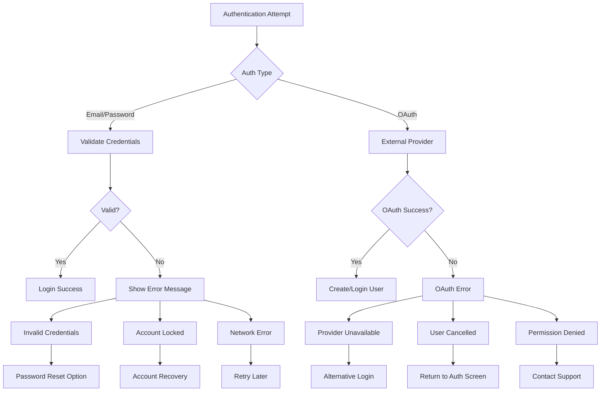
```mermaid
flowchart TD
    A[Authentication Attempt] --> B{Auth Type}
    B -->|Email/Password| C[Validate Credentials]
    B -->|OAuth| D[External Provider]

    C --> E{Valid?}
    E -->|Yes| F[Login Success]
    E -->|No| G[Show Error Message]

    D --> H{OAuth Success?}
    H -->|Yes| I[Create/Login User]
    H -->|No| J[OAuth Error]

    G --> K[Invalid Credentials]
    G --> L[Account Locked]
    G --> M[Network Error]

    J --> N[Provider Unavailable]
    J --> O[User Cancelled]
    J --> P[Permission Denied]

    K --> Q[Password Reset Option]
    L --> R[Account Recovery]
    M --> S[Retry Later]
    N --> T[Alternative Login]
    O --> U[Return to Auth Screen]
    P --> V[Contact Support]
```

#### **Authentication Error Examples:**

**Invalid Credentials:**

```
Login Error:
┌─────────────────────────────────┐
│ ❌ Login Failed                 │
│                                 │
│ The email or password you       │
│ entered is incorrect.           │
│                                 │
│ Please check your credentials   │
│ and try again.                  │
│                                 │
│ [Forgot Password?]              │
│ [Try Again] [Create Account]    │
└─────────────────────────────────┘
```

**Network Error:**

```
Connection Error:
┌─────────────────────────────────┐
│ 🌐 Connection Problem           │
│                                 │
│ Unable to connect to our        │
│ servers. Please check your      │
│ internet connection and         │
│ try again.                      │
│                                 │
│ If the problem persists,        │
│ please contact support.         │
│                                 │
│ [Retry] [Offline Mode]          │
└─────────────────────────────────┘
```

### **9.3 Data Sync Issues**

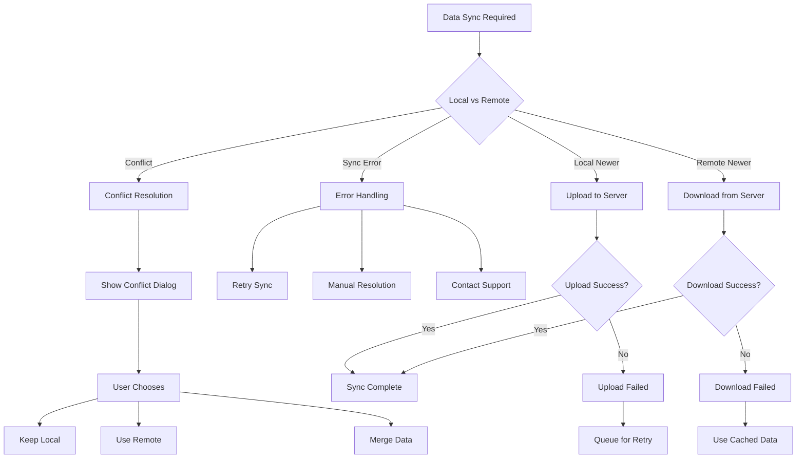
```mermaid
flowchart TD
    A[Data Sync Required] --> B{Local vs Remote}
    B -->|Conflict| C[Conflict Resolution]
    B -->|Local Newer| D[Upload to Server]
    B -->|Remote Newer| E[Download from Server]
    B -->|Sync Error| F[Error Handling]

    C --> G[Show Conflict Dialog]
    G --> H[User Chooses]
    H --> I[Keep Local]
    H --> J[Use Remote]
    H --> K[Merge Data]

    F --> L[Retry Sync]
    F --> M[Manual Resolution]
    F --> N[Contact Support]

    D --> O{Upload Success?}
    E --> P{Download Success?}

    O -->|Yes| Q[Sync Complete]
    O -->|No| R[Upload Failed]
    P -->|Yes| Q
    P -->|No| S[Download Failed]

    R --> T[Queue for Retry]
    S --> U[Use Cached Data]
```

#### **Sync Conflict Resolution:**

```
Data Sync Conflict:
┌─────────────────────────────────┐
│ 🔄 Sync Conflict Detected       │
├─────────────────────────────────┤
│ Your vocabulary has been        │
│ modified on another device.     │
│                                 │
│ Local: 247 words, modified 2h   │
│ Remote: 251 words, modified 1h  │
│                                 │
│ How would you like to resolve   │
│ this conflict?                  │
│                                 │
│ [Use Device Data] (Keep local)  │
│ [Use Cloud Data] (Use remote)   │
│ [Merge Both] (Combine)          │
│                                 │
│ 💡 Tip: Merge is usually the    │
│    safest option.               │
└─────────────────────────────────┘
```

### **9.4 AI Service Errors**

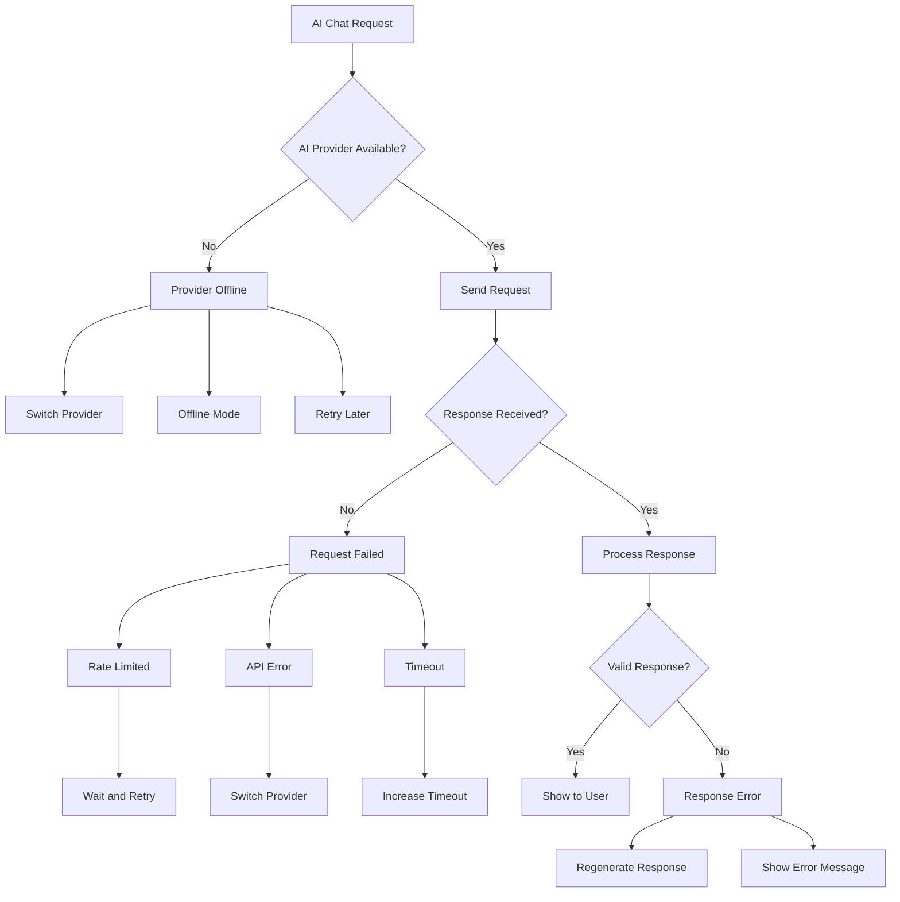
```mermaid
flowchart TD
    A[AI Chat Request] --> B{AI Provider Available?}
    B -->|No| C[Provider Offline]
    B -->|Yes| D[Send Request]

    C --> E[Switch Provider]
    C --> F[Offline Mode]
    C --> G[Retry Later]

    D --> H{Response Received?}
    H -->|Yes| I[Process Response]
    H -->|No| J[Request Failed]

    J --> K[Rate Limited]
    J --> L[API Error]
    J --> M[Timeout]

    K --> N[Wait and Retry]
    L --> O[Switch Provider]
    M --> P[Increase Timeout]

    I --> Q{Valid Response?}
    Q -->|Yes| R[Show to User]
    Q -->|No| S[Response Error]

    S --> T[Regenerate Response]
    S --> U[Show Error Message]
```

#### **AI Service Error Messages:**

**Provider Unavailable:**

```
AI Service Error:
┌─────────────────────────────────┐
│ 🤖❌ AI Temporarily Unavailable │
│                                 │
│ The AI service is currently     │
│ experiencing issues.            │
│                                 │
│ We've automatically switched    │
│ to backup provider.             │
│                                 │
│ [Retry Message] [Try Later]     │
│                                 │
│ 💡 Your progress is saved and   │
│    other features remain        │
│    available.                   │
└─────────────────────────────────┘
```

**Rate Limit Exceeded:**

```
Rate Limit Reached:
┌─────────────────────────────────┐
│ ⏱️ Slow Down There!             │
│                                 │
│ You've reached the message      │
│ limit for this minute.          │
│                                 │
│ Please wait 30 seconds before   │
│ sending another message.        │
│                                 │
│ ⏰ Time remaining: 0:23         │
│                                 │
│ [Wait] [Study Flashcards]       │
│                                 │
│ 💡 Use this time to review      │
│    your vocabulary!             │
└─────────────────────────────────┘
```

### **9.5 Empty States & First-Time User Experience**

#### **No Vocabulary Yet:**

```
Empty Vocabulary:
┌─────────────────────────────────┐
│ 📚 No Vocabulary Yet            │
│                                 │
│ You haven't learned any words   │
│ yet. Start building your        │
│ vocabulary collection!          │
│                                 │
│ 🚀 Get Started:                 │
│                                 │
│ 💬 Chat with AI Tutor           │
│    Words are automatically      │
│    extracted and saved          │
│                                 │
│ ✏️ Add Words Manually           │
│    Build your collection        │
│    one word at a time           │
│                                 │
│ 📄 Import from File             │
│    Upload existing vocabulary   │
│                                 │
│ [Start Chat] [Add Word] [Import]│
└─────────────────────────────────┘
```

#### **No Flashcards Available:**

```
No Flashcards Ready:
┌─────────────────────────────────┐
│ 🎯 Ready to Study?              │
│                                 │
│ You need some vocabulary before │
│ you can start studying          │
│ flashcards.                     │
│                                 │
│ 📈 Current Status:              │
│ • Total words: 0                │
│ • Ready for review: 0           │
│ • New words: 0                  │
│                                 │
│ 🎓 Start Learning:              │
│                                 │
│ [Chat with AI] [Add Vocabulary] │
│                                 │
│ 💡 Tip: Have a conversation     │
│    with the AI tutor to         │
│    automatically learn new      │
│    vocabulary!                  │
└─────────────────────────────────┘
```

---

## 🎯 User Journey Summaries

### **New User Complete Journey (Free → Premium)**

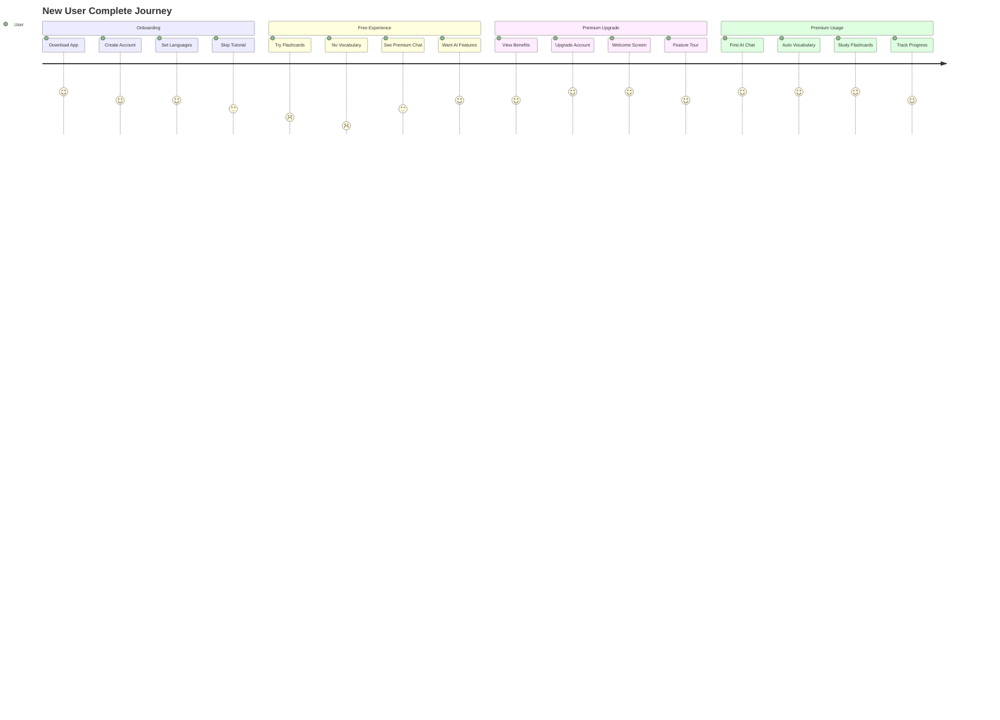
```mermaid
journey
    title New User Complete Journey
    section Onboarding
      Download App: 5: User
      Create Account: 4: User
      Set Languages: 4: User
      Skip Tutorial: 3: User
    section Free Experience
      Try Flashcards: 2: User
      No Vocabulary: 1: User
      See Premium Chat: 3: User
      Want AI Features: 4: User
    section Premium Upgrade
      View Benefits: 4: User
      Upgrade Account: 5: User
      Welcome Screen: 5: User
      Feature Tour: 4: User
    section Premium Usage
      First AI Chat: 5: User
      Auto Vocabulary: 5: User
      Study Flashcards: 5: User
      Track Progress: 4: User
```

### **Daily Active User Journey**

```mermaid
journey
    title Daily Active Premium User
    section Morning Study
      Open App: 5: User
      Check Progress: 4: User
      Study Session: 5: User
      Complete Goals: 5: User
    section Conversation Practice
      Start AI Chat: 5: User
      Practice Dialogue: 5: User
      Learn New Words: 5: User
      Save Favorites: 4: User
    section Progress Review
      View Analytics: 4: User
      Plan Next Session: 4: User
      Adjust Settings: 3: User
      Sign Out: 5: User
```

### **Vocabulary Learning Cycle**

```mermaid
journey
    title Vocabulary Learning Cycle
    section Discovery
      Chat with AI: 5: User
      New Words Found: 5: User
      Auto-Saved: 5: User
      Review Additions: 4: User
    section Initial Learning
      First Flashcard: 4: User
      Learn Definition: 4: User
      Practice Usage: 4: User
      Mark Difficulty: 3: User
    section Reinforcement
      Spaced Review: 4: User
      Multiple Contexts: 5: User
      Improve Accuracy: 4: User
      Build Confidence: 5: User
    section Mastery
      Consistent Success: 5: User
      Long Intervals: 4: User
      Natural Usage: 5: User
      Word Mastered: 5: User
```

---

## 📊 User Experience Metrics

### **Key Performance Indicators (KPIs)**

**Engagement Metrics:**

- Daily Active Users (DAU)
- Session Duration
- Feature Usage Rates
- Retention Rates (1-day, 7-day, 30-day)

**Learning Metrics:**

- Words Learned per Session
- Flashcard Accuracy Rates
- Study Streak Lengths
- Vocabulary Growth Rate

**Conversion Metrics:**

- Free to Premium Conversion Rate
- Premium Feature Adoption
- Churn Rate
- User Lifetime Value

### **User Satisfaction Touchpoints**

**Positive Experience Moments:**

- ✅ Successful vocabulary extraction from chat
- 🎉 Completing a study session with high accuracy
- 📈 Seeing vocabulary growth statistics
- 🌟 Achieving learning milestones
- 💬 Engaging AI conversations

**Potential Friction Points:**

- 🔄 Slow AI response times
- 📱 App crashes or bugs
- 🌐 Network connectivity issues
- 💰 Premium paywall encounters
- 📚 Empty vocabulary states

**Optimization Opportunities:**

- Faster AI response generation
- Better offline mode functionality
- Smoother premium upgrade flow
- More engaging empty states
- Clearer progress visualization

---

This comprehensive user flow documentation covers all major user journeys, decision points, and interaction patterns within the GitFluent language learning application. It serves as a complete reference for understanding how users navigate and interact with the app's features, from initial onboarding through advanced premium functionality.
