# GitFluent - Complete User Flow Documentation

A comprehensive guide to all user journeys and interactions within the GitFluent language learning application.

## 📱 App Overview

**GitFluent** is a freemium language learning app with two main user types:

- **Free Users**: Access to flashcards, vocabulary management, and basic features
- **Premium Users**: Full AI chat functionality plus all free features

## 🎯 Core User Flows

### **Flow Index:**

1. [Onboarding & Authentication](#1-onboarding--authentication-flow)
2. [Free User Experience](#2-free-user-experience-flow)
3. [Premium User Experience](#3-premium-user-experience-flow)
4. [AI Chat & Vocabulary Learning](#4-ai-chat--vocabulary-learning-flow)
5. [Flashcard Study Session](#5-flashcard-study-session-flow)
6. [Vocabulary Management](#6-vocabulary-management-flow)
7. [Settings & Configuration](#7-settings--configuration-flow)
8. [Premium Upgrade](#8-premium-upgrade-flow)
9. [Error Handling & Edge Cases](#9-error-handling--edge-cases)

---

## 1. Onboarding & Authentication Flow

### **1.1 First App Launch**


#### **Detailed Steps:**

**Step 1: App Initialization**

- App loads and checks authentication state
- Shows loading screen with app logo
- Initializes core services (Supabase, debug helper)

**Step 2: Authentication Check**

- `UserService` checks for existing session
- If logged in → proceed to main app
- If not logged in → show `AuthScreen`

**Step 3: Authentication Options**

```
AuthScreen Layout:
┌─────────────────────────────────┐
│         GitFluent Logo          │
│    Learn Languages with AI      │
├─────────────────────────────────┤
│  📧 Email/Password Login        │
│  🔵 Continue with Google        │
│  🍎 Continue with Apple         │
├─────────────────────────────────┤
│  Don't have an account?         │
│  → Sign Up                      │
└─────────────────────────────────┘
```

**Step 4: Account Creation Process**

- **Email/Password**: Form validation, password strength check
- **OAuth**: Redirect to provider, handle callback, auto-create profile
- **Profile Setup**: First name, last name, optional profile picture

**Step 5: Initial Setup**

- Load user preferences from database
- Initialize language settings (target/native languages)
- Check premium status
- Show onboarding tutorial for new users

---

## 2. Free User Experience Flow

### **2.1 Free User Home Screen**

```mermaid
flowchart TD
    A[Free User Login] --> B[AppHome - Non-Premium]
    B --> C[Welcome Message]
    C --> D[Available Features Grid]

    D --> E[📚 Study Flashcards]
    D --> F[📖 My Vocabulary]
    D --> G[⚙️ Settings]
    D --> H[💬 AI Chat - Premium]

    E --> I[FlashcardStartScreen]
    F --> J[UserVocabularyScreen]
    G --> K[SettingsScreen]
    H --> L[Premium Upgrade Prompt]

    L --> M{Upgrade Choice}
    M -->|Yes| N[Upgrade to Premium]
    M -->|No| O[Return to Home]

    style H fill:#ffebee,stroke:#d32f2f
    style L fill:#fff3e0,stroke:#ef6c00
```



#### **Free User Interface Layout:**

```
Free User Home Screen:
┌─────────────────────────────────┐
│  Welcome, [User Name]!     🔓   │
│                                 │
│  Available Features:            │
│  ┌─────────┐ ┌─────────┐       │
│  │   📚    │ │   📖    │       │
│  │ Study   │ │   My    │       │
│  │Flashcrd │ │ Vocab   │       │
│  └─────────┘ └─────────┘       │
│  ┌─────────┐ ┌─────────┐       │
│  │   ⚙️    │ │   💬⭐  │       │
│  │Settings │ │AI Chat  │       │
│  │         │ │Premium  │       │
│  └─────────┘ └─────────┘       │
│                                 │
│  🌟 Upgrade to Premium          │
│  Unlock AI-powered features!    │
│  [Upgrade Now]                  │
└─────────────────────────────────┘
```

### **2.2 Free User Feature Access**

**Available Features:**

- ✅ **Flashcard Study**: Full access to spaced repetition system
- ✅ **Vocabulary Management**: View, edit, and organize words
- ✅ **Settings**: Configure app preferences and languages
- ✅ **Progress Tracking**: Basic study statistics

**Restricted Features:**

- ❌ **AI Chat**: Requires premium upgrade
- ❌ **Advanced Analytics**: Premium-only detailed insights
- ❌ **Vocabulary Extraction**: No automatic word extraction from conversations

---

## 3. Premium User Experience Flow

### **3.1 Premium User Interface**

```mermaid
flowchart TD
    A[Premium User Login] --> B[ChatScreen - Main Interface]
    B --> C[AI Chat Interface]
    C --> D[Message Input]
    D --> E[Send Message]
    E --> F[AI Processing]
    F --> G[AI Response]
    G --> H[Vocabulary Extraction]
    H --> I[Auto-save New Words]
    I --> J[Update Vocabulary Stats]

    B --> K[Navigation Menu]
    K --> L[📚 Flashcards]
    K --> M[📖 Vocabulary]
    K --> N[⚙️ Settings]
    K --> O[📊 Analytics]

    style A fill:#e8f5e8,stroke:#2e7d32
    style B fill:#e8f5e8,stroke:#2e7d32
```



#### **Premium User Interface Layout:**

```
Premium Chat Screen:
┌─────────────────────────────────┐
│  GitFluent        ⭐Premium [≡] │
├─────────────────────────────────┤
│                                 │
│  🤖 AI: Ciao! Come stai oggi?   │
│                                 │
│  👤 You: Sto bene, grazie!      │
│                                 │
│  🤖 AI: Perfetto! Vuoi          │
│      praticare il vocabolario?  │
│                                 │
│  📝 +3 new words added          │
│     • praticare (practice)      │
│     • vocabolario (vocabulary)  │
│     • perfetto (perfect)        │
│                                 │
├─────────────────────────────────┤
│ Type your message... [🎤] [📎] │
└─────────────────────────────────┘

Navigation Menu:
┌─────────────────┐
│ 📚 Flashcards   │
│ 📖 Vocabulary   │
│ 📊 Analytics    │
│ ⚙️ Settings     │
│ 🚪 Sign Out     │
└─────────────────┘
```

---

## 4. AI Chat & Vocabulary Learning Flow

### **4.1 AI Conversation Cycle**


#### **Detailed Conversation Flow:**

**Step 1: User Input**

```
User types: "Mi piace molto la pizza italiana"
```

**Step 2: AI Processing**

- Message sent to selected AI provider (OpenAI/Gemini)
- AI generates contextual response in target language
- Response includes corrections, encouragement, follow-up questions

**Step 3: Vocabulary Extraction**

```dart
// Automatic vocabulary detection
Extracted words:
- "piace" (to like) - verb
- "molto" (very) - adverb
- "pizza" (pizza) - noun
- "italiana" (Italian) - adjective
```

**Step 4: Auto-save to Vocabulary**

- New words automatically added to user's vocabulary collection
- Difficulty estimated based on word frequency and complexity
- Initial mastery level set to 0 (new word)
- Review scheduled for next day

**Step 5: User Notification**

```
📝 New vocabulary added:
• piace (to like)
• molto (very)
• italiana (Italian)

[Study Now] [View Vocabulary]
```

### **4.2 Chat Interface Features**

**Real-time Features:**

- ⌨️ **Live typing indicator** while AI generates response
- 📝 **Auto-vocabulary extraction** from every AI message
- 🔄 **Message history** persisted across sessions
- 🎯 **Context awareness** for coherent conversations
- 🌍 **Language-specific prompts** based on user settings

**Interactive Elements:**

```
Chat Message Layout:
┌─────────────────────────────────┐
│ 🤖 AI: Che cosa fai nel tempo   │
│       libero?                   │
│                                 │
│ [🔊 Listen] [📋 Copy] [⭐ Save] │
│                                 │
│ 📝 New words:                   │
│ • tempo (time) - noun           │
│ • libero (free) - adjective     │
│ [+ Add to Flashcards]           │
└─────────────────────────────────┘
```

---

## 5. Flashcard Study Session Flow

### **5.1 Study Session Configuration**


#### **Configuration Screen Layout:**

```
Flashcard Configuration:
┌─────────────────────────────────┐
│ Study Flashcards           [X]  │
├─────────────────────────────────┤
│ 📊 Vocabulary Status            │
│ Total words: 247                │
│ Due for review: 23              │
│ New words: 15                   │
├─────────────────────────────────┤
│ ⏱️ Session Duration             │
│ ●────●────────────── 15 min     │
│                                 │
│ 🎯 Max Words: 25                │
│ ●──────●──────────── [25]       │
│                                 │
│ 🌍 Language: Italian            │
│ [Italian ▼]                     │
│                                 │
│ 📝 Word Types:                  │
│ ☑️ Verbs    ☑️ Nouns            │
│ ☑️ Adjectives ☐ Adverbs         │
│                                 │
│ 🎛️ Preferences:                 │
│ ☑️ Prioritize review words      │
│ ☑️ Include favorites            │
│ ☐ Focus on difficult words     │
├─────────────────────────────────┤
│        [Start Session]          │
└─────────────────────────────────┘
```

### **5.2 Active Study Session**


#### **Question Types & Interface:**

**1. Traditional Flashcard (Word → Translation)**

```
Traditional Question:
┌─────────────────────────────────┐
│ Question 5 of 25        ⏱️ 2:30 │
├─────────────────────────────────┤
│                                 │
│           🇮🇹                   │
│                                 │
│         mangiare                │
│                                 │
│    What does this mean?         │
│                                 │
│ ┌─────────────────────────────┐ │
│ │ Type your answer...         │ │
│ └─────────────────────────────┘ │
│                                 │
│ [Skip] [Hint] [Submit Answer]   │
│                                 │
│ Progress: ████████░░ 80%        │
└─────────────────────────────────┘
```

**2. Multiple Choice**

```
Multiple Choice Question:
┌─────────────────────────────────┐
│ Question 12 of 25       ⏱️ 1:45 │
├─────────────────────────────────┤
│                                 │
│ What does "veloce" mean?        │
│                                 │
│ A) 🐌 Slow                      │
│ B) 🏃 Fast                      │
│ C) 🚗 Car                       │
│ D) 🏠 House                     │
│                                 │
│ [Select your answer]            │
│                                 │
│ Progress: ████████████░ 90%     │
└─────────────────────────────────┘
```

**3. Fill in the Blank**

```
Fill in the Blank:
┌─────────────────────────────────┐
│ Question 18 of 25       ⏱️ 1:15 │
├─────────────────────────────────┤
│                                 │
│ Complete the sentence:          │
│                                 │
│ "Oggi _____ molto caldo"        │
│ (Today is very hot)             │
│                                 │
│ ┌─────────────────────────────┐ │
│ │ Type the missing word...    │ │
│ └─────────────────────────────┘ │
│                                 │
│ [Submit] [Show Hint]            │
│                                 │
│ Progress: ██████████████░ 95%   │
└─────────────────────────────────┘
```

### **5.3 Answer Feedback System**


#### **Feedback Interface Examples:**

**Correct Answer:**

```
Correct Feedback:
┌─────────────────────────────────┐
│         ✅ Correct!             │
│                                 │
│ mangiare = to eat               │
│                                 │
│ Great job! You're learning      │
│ Italian verbs quickly! 🎉       │
│                                 │
│ How difficult was this?         │
│                                 │
│ [Again] [Hard] [Good] [Easy]    │
│                                 │
│         [Continue →]            │
└─────────────────────────────────┘
```

**Incorrect Answer:**

```
Incorrect Feedback:
┌─────────────────────────────────┐
│         ❌ Not quite            │
│                                 │
│ You answered: "to drink"        │
│ Correct answer: "to eat"        │
│                                 │
│ 💡 Tip: "mangiare" is related   │
│    to "manger" in French       │
│                                 │
│ Don't worry, you'll get it!     │
│                                 │
│         [Continue →]            │
└─────────────────────────────────┘
```

### **5.4 Session Completion & Results**


#### **Results Screen Layout:**

```
Session Results:
┌─────────────────────────────────┐
│ 🎉 Session Complete!            │
├─────────────────────────────────┤
│ 📊 Your Performance:            │
│                                 │
│ ⏱️ Time: 15:00 / 15:00          │
│ 📝 Words Studied: 25            │
│ ✅ Accuracy: 84% (21/25)        │
│ ⚡ Avg Response: 3.2s           │
│                                 │
│ 📈 Difficulty Breakdown:        │
│ Easy: ████████░░ 8              │
│ Good: ██████░░░░ 6              │
│ Hard: ████░░░░░░ 4              │
│ Again: ██░░░░░░░░ 2             │
│                                 │
│ 🎯 Next Review:                 │
│ • 12 words tomorrow             │
│ • 8 words next week             │
│ • 3 words next month            │
│                                 │
│ 💡 Recommendation:              │
│ Great progress! Focus on verbs  │
│ in your next session.           │
├─────────────────────────────────┤
│ [Study Again] [View Vocabulary] │
│           [Home]                │
└─────────────────────────────────┘
```

---

## 6. Vocabulary Management Flow

### **6.1 Vocabulary Collection Overview**


#### **Vocabulary Screen Layout:**

```
My Vocabulary:
┌─────────────────────────────────┐
│ My Vocabulary     🔄📚[≡]       │
├─────────────────────────────────┤
│ User Account (247) | Local (12) │
├─────────────────────────────────┤
│ 🔍 Search: [mangiare________]   │
│                                 │
│ Filters: [All Types ▼] [All ▼] │
│ Sort: [Recent ▼]               │
├─────────────────────────────────┤
│ 📝 mangiare (to eat)           │
│ Verb • Mastery: 75% • Due: 2d   │
│ ⭐ [Study] [Edit] [❤️]          │
├─────────────────────────────────┤
│ 🏠 casa (house)                │
│ Noun • Mastery: 90% • Mastered  │
│ [Study] [Edit] [💙]            │
├─────────────────────────────────┤
│ ⚡ veloce (fast)               │
│ Adj • Mastery: 45% • Due: 1d    │
│ [Study] [Edit] [🤍]            │
├─────────────────────────────────┤
│ 📊 Statistics: 247 total        │
│ 🎯 23 due for review            │
│ ⭐ 189 mastered                 │
└─────────────────────────────────┘
```

### **6.2 Word Detail & Management**


#### **Word Detail View:**

```
Word Details: "mangiare"
┌─────────────────────────────────┐
│ ← mangiare                [⭐]  │
├─────────────────────────────────┤
│ 🇮🇹 Italian Verb                │
│ 🇺🇸 to eat                      │
│                                 │
│ 📊 Learning Progress:           │
│ Mastery: ████████░░ 75%         │
│ Seen: 12 times                  │
│ Correct: 9 times (75%)          │
│ Next review: in 3 days          │
│ Learning streak: 5 days         │
│                                 │
│ 📝 Word Forms:                  │
│ • mangio (I eat)                │
│ • mangi (you eat)               │
│ • mangia (he/she eats)          │
│                                 │
│ 💬 Example Sentences:           │
│ • "Mangio la pizza"             │
│   (I eat pizza)                 │
│ • "Cosa mangi?" (What do you eat?) │
│                                 │
│ 📈 Performance Graph:           │
│ ████░░ ██████░ ████████         │
│ Week 1  Week 2   Week 3         │
├─────────────────────────────────┤
│ [Edit] [Practice] [Delete]      │
└─────────────────────────────────┘
```

### **6.3 Import & Export Functions**

**Import Sources:**

- 📱 **From Chat**: Automatically extracted during AI conversations
- 📄 **CSV Import**: Upload vocabulary files
- 🔄 **Sync from Cloud**: Merge with existing vocabulary
- 📝 **Manual Entry**: Add words individually

**Export Options:**

- 💾 **CSV Export**: Download vocabulary for external use
- 📤 **Share Collection**: Share with other users
- ☁️ **Backup to Cloud**: Ensure data safety

---

## 7. Settings & Configuration Flow

### **7.1 Settings Navigation**

```mermaid
flowchart TD
    A[Navigate to Settings] --> B[SettingsScreen]
    B --> C[Settings Categories]

    C --> D[👤 Account Settings]
    C --> E[🌍 Language Preferences]
    C --> F[🤖 AI Provider Settings]
    C --> G[📚 Study Preferences]
    C --> H[🔔 Notifications]
    C --> I[🎨 Appearance]
    C --> J[🔒 Privacy & Security]
    C --> K[ℹ️ About & Help]

    D --> L[Profile Information]
    D --> M[Premium Status]
    D --> N[Account Management]

    E --> O[Target Language]
    E --> P[Native Language]
    E --> Q[Support Languages]

    F --> R[OpenAI/Gemini Toggle]
    F --> S[API Configuration]

    G --> T[Default Session Length]
    G --> U[Question Type Preferences]
    G --> V[Difficulty Settings]

    L --> W[Edit Profile Dialog]
    M --> X[Upgrade/Manage Premium]
    N --> Y[Sign Out/Delete Account]
```



#### **Settings Screen Layout:**

```
Settings:
┌─────────────────────────────────┐
│ ← Settings                      │
├─────────────────────────────────┤
│ 👤 Account                      │
│ John Doe • Premium ⭐           │
│ john@example.com                │
│ [Edit Profile] [Manage Premium] │
├─────────────────────────────────┤
│ 🌍 Languages                    │
│ Learning: Italian 🇮🇹           │
│ Native: English 🇺🇸             │
│ [Change Languages]              │
├─────────────────────────────────┤
│ 🤖 AI Provider                  │
│ Current: Gemini                 │
│ ○ OpenAI  ● Gemini             │
├─────────────────────────────────┤
│ 📚 Study Preferences            │
│ Default session: 15 minutes     │
│ Max words per session: 25       │
│ Question types: All enabled     │
│ [Configure Study Settings]      │
├─────────────────────────────────┤
│ 🔔 Notifications                │
│ Daily reminders: ON             │
│ Study streaks: ON               │
│ New vocabulary: ON              │
├─────────────────────────────────┤
│ 🎨 Appearance                   │
│ Theme: System                   │
│ ○ Light  ○ Dark  ● System      │
├─────────────────────────────────┤
│ 🔒 Privacy & Security           │
│ Data backup: Enabled            │
│ [Privacy Policy] [Terms]        │
├─────────────────────────────────┤
│ [Sign Out] [Delete Account]     │
└─────────────────────────────────┘
```

### **7.2 Language Configuration**

```mermaid
flowchart TD
    A[Change Languages] --> B[LanguageSelectionScreen]
    B --> C[Target Language Selection]
    C --> D[Available Languages List]
    D --> E[Italian 🇮🇹]
    D --> F[Spanish 🇪🇸]
    D --> G[French 🇫🇷]
    D --> H[German 🇩🇪]
    D --> I[Portuguese 🇵🇹]
    D --> J[More Languages...]

    E --> K[Select Italian]
    K --> L[Native Language Selection]
    L --> M[Select Native Language]
    M --> N[Optional Support Languages]
    N --> O[Save Configuration]
    O --> P[Sync with Database]
    P --> Q[Update App Context]
    Q --> R[Restart Required Prompt]
    R --> S[Apply Changes]
```



#### **Language Selection Interface:**

```
Language Settings:
┌─────────────────────────────────┐
│ ← Language Preferences          │
├─────────────────────────────────┤
│ 🎯 What language are you        │
│    learning?                    │
│                                 │
│ ● 🇮🇹 Italian                   │
│ ○ 🇪🇸 Spanish                   │
│ ○ 🇫🇷 French                    │
│ ○ 🇩🇪 German                    │
│ ○ 🇵🇹 Portuguese                │
│ ○ More languages...             │
├─────────────────────────────────┤
│ 🏠 What's your native           │
│    language?                    │
│                                 │
│ ● 🇺🇸 English                   │
│ ○ 🇪🇸 Spanish                   │
│ ○ 🇫🇷 French                    │
│ ○ Other...                      │
├─────────────────────────────────┤
│ 🤝 Support languages (optional) │
│                                 │
│ 1st: [Select Language ▼]       │
│ 2nd: [Select Language ▼]       │
├─────────────────────────────────┤
│         [Save Changes]          │
└─────────────────────────────────┘
```

---

## 8. Premium Upgrade Flow

### **8.1 Upgrade Triggers & Entry Points**


#### **Upgrade Prompt Examples:**

**Chat Feature Attempt:**

```
Premium Required:
┌─────────────────────────────────┐
│         🤖💬 AI Chat            │
│                                 │
│ Unlock intelligent conversation │
│ features with premium access!   │
│                                 │
│ ✨ Premium Benefits:            │
│ • Unlimited AI conversations    │
│ • Automatic vocabulary learning │
│ • Advanced progress analytics   │
│ • Priority customer support     │
│                                 │
│ 🎯 Perfect for serious language │
│    learners who want to         │
│    accelerate their progress!   │
│                                 │
│ [Upgrade to Premium] [Not Now]  │
└─────────────────────────────────┘
```

**Feature Comparison:**

```
Free vs Premium:
┌─────────────────────────────────┐
│ Feature Comparison              │
├──────────────┬──────────────────┤
│ Feature      │ Free  │ Premium  │
├──────────────┼───────┼──────────┤
│ Flashcards   │  ✅   │    ✅    │
│ Vocabulary   │  ✅   │    ✅    │
│ Basic Stats  │  ✅   │    ✅    │
│ AI Chat      │  ❌   │    ✅    │
│ Auto Extract │  ❌   │    ✅    │
│ Advanced     │  ❌   │    ✅    │
│ Analytics    │       │          │
│ Priority     │  ❌   │    ✅    │
│ Support      │       │          │
├──────────────┴───────┴──────────┤
│ Ready to unlock full potential? │
│                                 │
│ 🏷️ Special Launch Price:        │
│ $4.99/month (reg. $9.99)       │
│                                 │
│         [Upgrade Now]           │
└─────────────────────────────────┘
```

### **8.2 Mock Premium Upgrade Process**

**Note**: This app uses a mock premium system for demonstration purposes.


**Mock Payment Interface:**

```
Premium Upgrade:
┌─────────────────────────────────┐
│ 🌟 Upgrade to Premium           │
├─────────────────────────────────┤
│ 💳 Payment Details              │
│ (Demo Mode - No Real Payment)   │
│                                 │
│ Plan: Monthly Premium           │
│ Price: $4.99/month              │
│                                 │
│ [●] I agree to Terms of Service │
│ [●] I agree to Privacy Policy   │
│                                 │
│ 🔒 Secure Checkout              │
│ ┌─────────────────────────────┐ │
│ │ **** **** **** 1234         │ │
│ │ John Doe            12/25   │ │
│ │ CVV: ***                    │ │
│ └─────────────────────────────┘ │
│                                 │
│ [Complete Upgrade - $4.99]      │
│                                 │
│ 💡 Note: This is a demo app.    │
│    No actual payment will be    │
│    processed.                   │
└─────────────────────────────────┘
```

### **8.3 Premium Welcome & Onboarding**

```mermaid
flowchart TD
    A[Premium Upgrade Complete] --> B[Welcome Screen]
    B --> C[Premium Benefits Highlight]
    C --> D[🤖 AI Chat Unlocked]
    C --> E[📊 Advanced Analytics]
    C --> F[🔄 Auto Vocabulary Extraction]
    C --> G[⭐ Priority Support]

    B --> H[Feature Tour]
    H --> I[Chat Interface Tour]
    I --> J[Show Message Input]
    J --> K[Explain AI Features]
    K --> L[Vocabulary Extraction Demo]
    L --> M[Analytics Overview]
    M --> N[Tour Complete]

    N --> O[Start First Chat]
    O --> P[Navigate to ChatScreen]
```



**Premium Welcome Screen:**

```
Welcome to Premium! 🌟
┌─────────────────────────────────┐
│ 🎉 Congratulations!             │
│                                 │
│ You now have access to:         │
│                                 │
│ 🤖 Unlimited AI Conversations   │
│    Practice with intelligent    │
│    language tutors              │
│                                 │
│ 📝 Automatic Vocabulary         │
│    New words extracted and      │
│    saved automatically          │
│                                 │
│ 📊 Advanced Analytics           │
│    Detailed progress tracking   │
│    and learning insights        │
│                                 │
│ ⭐ Priority Support             │
│    Fast help when you need it   │
│                                 │
│ Ready to start learning?        │
│                                 │
│ [Take Feature Tour] [Start Chat]│
└─────────────────────────────────┘
```

---

## 9. Error Handling & Edge Cases

### **9.1 Network & Connectivity Issues**


#### **Offline Mode Interface:**

```
Offline Mode:
┌─────────────────────────────────┐
│ 📶❌ No Internet Connection     │
├─────────────────────────────────┤
│ You're currently offline.       │
│ Some features are limited:      │
│                                 │
│ ✅ Available:                   │
│ • Study saved flashcards        │
│ • Review vocabulary             │
│ • View previous conversations   │
│ • Change app settings           │
│                                 │
│ ❌ Unavailable:                 │
│ • AI chat conversations         │
│ • Sync vocabulary               │
│ • Real-time progress tracking   │
│                                 │
│ 🔄 Your actions will sync when  │
│    internet is restored.        │
│                                 │
│ [Retry Connection] [Continue]   │
└─────────────────────────────────┘
```

### **9.2 Authentication Errors**


#### **Authentication Error Examples:**

**Invalid Credentials:**

```
Login Error:
┌─────────────────────────────────┐
│ ❌ Login Failed                 │
│                                 │
│ The email or password you       │
│ entered is incorrect.           │
│                                 │
│ Please check your credentials   │
│ and try again.                  │
│                                 │
│ [Forgot Password?]              │
│ [Try Again] [Create Account]    │
└─────────────────────────────────┘
```

**Network Error:**

```
Connection Error:
┌─────────────────────────────────┐
│ 🌐 Connection Problem           │
│                                 │
│ Unable to connect to our        │
│ servers. Please check your      │
│ internet connection and         │
│ try again.                      │
│                                 │
│ If the problem persists,        │
│ please contact support.         │
│                                 │
│ [Retry] [Offline Mode]          │
└─────────────────────────────────┘
```

### **9.3 Data Sync Issues**


#### **Sync Conflict Resolution:**

```
Data Sync Conflict:
┌─────────────────────────────────┐
│ 🔄 Sync Conflict Detected       │
├─────────────────────────────────┤
│ Your vocabulary has been        │
│ modified on another device.     │
│                                 │
│ Local: 247 words, modified 2h   │
│ Remote: 251 words, modified 1h  │
│                                 │
│ How would you like to resolve   │
│ this conflict?                  │
│                                 │
│ [Use Device Data] (Keep local)  │
│ [Use Cloud Data] (Use remote)   │
│ [Merge Both] (Combine)          │
│                                 │
│ 💡 Tip: Merge is usually the    │
│    safest option.               │
└─────────────────────────────────┘
```

### **9.4 AI Service Errors**


#### **AI Service Error Messages:**

**Provider Unavailable:**

```
AI Service Error:
┌─────────────────────────────────┐
│ 🤖❌ AI Temporarily Unavailable │
│                                 │
│ The AI service is currently     │
│ experiencing issues.            │
│                                 │
│ We've automatically switched    │
│ to backup provider.             │
│                                 │
│ [Retry Message] [Try Later]     │
│                                 │
│ 💡 Your progress is saved and   │
│    other features remain        │
│    available.                   │
└─────────────────────────────────┘
```

**Rate Limit Exceeded:**

```
Rate Limit Reached:
┌─────────────────────────────────┐
│ ⏱️ Slow Down There!             │
│                                 │
│ You've reached the message      │
│ limit for this minute.          │
│                                 │
│ Please wait 30 seconds before   │
│ sending another message.        │
│                                 │
│ ⏰ Time remaining: 0:23         │
│                                 │
│ [Wait] [Study Flashcards]       │
│                                 │
│ 💡 Use this time to review      │
│    your vocabulary!             │
└─────────────────────────────────┘
```

### **9.5 Empty States & First-Time User Experience**

#### **No Vocabulary Yet:**

```
Empty Vocabulary:
┌─────────────────────────────────┐
│ 📚 No Vocabulary Yet            │
│                                 │
│ You haven't learned any words   │
│ yet. Start building your        │
│ vocabulary collection!          │
│                                 │
│ 🚀 Get Started:                 │
│                                 │
│ 💬 Chat with AI Tutor           │
│    Words are automatically      │
│    extracted and saved          │
│                                 │
│ ✏️ Add Words Manually           │
│    Build your collection        │
│    one word at a time           │
│                                 │
│ 📄 Import from File             │
│    Upload existing vocabulary   │
│                                 │
│ [Start Chat] [Add Word] [Import]│
└─────────────────────────────────┘
```

#### **No Flashcards Available:**

```
No Flashcards Ready:
┌─────────────────────────────────┐
│ 🎯 Ready to Study?              │
│                                 │
│ You need some vocabulary before │
│ you can start studying          │
│ flashcards.                     │
│                                 │
│ 📈 Current Status:              │
│ • Total words: 0                │
│ • Ready for review: 0           │
│ • New words: 0                  │
│                                 │
│ 🎓 Start Learning:              │
│                                 │
│ [Chat with AI] [Add Vocabulary] │
│                                 │
│ 💡 Tip: Have a conversation     │
│    with the AI tutor to         │
│    automatically learn new      │
│    vocabulary!                  │
└─────────────────────────────────┘
```

---

## 🎯 User Journey Summaries

### **New User Complete Journey (Free → Premium)**


### **Daily Active User Journey**

```mermaid
journey
    title Daily Active Premium User
    section Morning Study
      Open App: 5: User
      Check Progress: 4: User
      Study Session: 5: User
      Complete Goals: 5: User
    section Conversation Practice
      Start AI Chat: 5: User
      Practice Dialogue: 5: User
      Learn New Words: 5: User
      Save Favorites: 4: User
    section Progress Review
      View Analytics: 4: User
      Plan Next Session: 4: User
      Adjust Settings: 3: User
      Sign Out: 5: User
```

### **Vocabulary Learning Cycle**

```mermaid
journey
    title Vocabulary Learning Cycle
    section Discovery
      Chat with AI: 5: User
      New Words Found: 5: User
      Auto-Saved: 5: User
      Review Additions: 4: User
    section Initial Learning
      First Flashcard: 4: User
      Learn Definition: 4: User
      Practice Usage: 4: User
      Mark Difficulty: 3: User
    section Reinforcement
      Spaced Review: 4: User
      Multiple Contexts: 5: User
      Improve Accuracy: 4: User
      Build Confidence: 5: User
    section Mastery
      Consistent Success: 5: User
      Long Intervals: 4: User
      Natural Usage: 5: User
      Word Mastered: 5: User
```

---

## 📊 User Experience Metrics

### **Key Performance Indicators (KPIs)**

**Engagement Metrics:**

- Daily Active Users (DAU)
- Session Duration
- Feature Usage Rates
- Retention Rates (1-day, 7-day, 30-day)

**Learning Metrics:**

- Words Learned per Session
- Flashcard Accuracy Rates
- Study Streak Lengths
- Vocabulary Growth Rate

**Conversion Metrics:**

- Free to Premium Conversion Rate
- Premium Feature Adoption
- Churn Rate
- User Lifetime Value

### **User Satisfaction Touchpoints**

**Positive Experience Moments:**

- ✅ Successful vocabulary extraction from chat
- 🎉 Completing a study session with high accuracy
- 📈 Seeing vocabulary growth statistics
- 🌟 Achieving learning milestones
- 💬 Engaging AI conversations

**Potential Friction Points:**

- 🔄 Slow AI response times
- 📱 App crashes or bugs
- 🌐 Network connectivity issues
- 💰 Premium paywall encounters
- 📚 Empty vocabulary states

**Optimization Opportunities:**

- Faster AI response generation
- Better offline mode functionality
- Smoother premium upgrade flow
- More engaging empty states
- Clearer progress visualization

---

This comprehensive user flow documentation covers all major user journeys, decision points, and interaction patterns within the GitFluent language learning application. It serves as a complete reference for understanding how users navigate and interact with the app's features, from initial onboarding through advanced premium functionality.
