# ConversationService Message Processing Flow

This diagram focuses on the core message processing cycle within the ConversationService, showing how user messages are handled and responses are generated.

## Process Overview

The message flow handles the complete cycle from user input to formatted educational responses, including structured parsing of AI responses for language learning features.

## Message Processing Flow

```mermaid
flowchart TD
    A["👤 User Types Message"] --> B["📨 sendMessage(text)"]
    B --> C{{"🔍 Valid Message?<br/>(not empty & model ready)"}}

    C -->|"❌ No"| D["🚫 Return Early"]
    C -->|"✅ Yes"| E["💬 Create User Message<br/>with unique ID"]

    E --> F["📱 Add to UI Messages"]
    F --> G["📚 Add to Chat History<br/>as HumanChatMessage"]
    G --> H["🔄 Set isLoading = true"]
    H --> I["🔔 notifyListeners()"]

    I --> J["🤖 Gemini API Call<br/>generateContent(chatHistory)"]
    J --> K{{"📡 API Response?"}}

    K -->|"💥 Error"| L["⚠️ Catch Exception"]
    K -->|"✅ Success"| M["📨 Get Raw Response Text"]

    L --> N["📝 Log Error Message"]
    N --> O["💬 Add Error to UI"]
    O --> P["🔄 Set isLoading = false"]

    M --> Q{{"🔍 Response Empty?"}}
    Q -->|"✅ Has Content"| R["🎯 Try JSON Parsing"]
    Q -->|"❌ Empty"| S["💬 Default Sorry Message"]

    R --> T{{"📋 Valid JSON?"}}
    T -->|"✅ Parsed"| U["📊 Create ConversationResponse"]
    T -->|"❌ Failed"| V["📝 Log Parse Error"]

    U --> W["🎨 Format Rich Response<br/>• Bot: [response]<br/>• Translation: [translation]<br/>• New Vocab: [words]<br/>• Corrections: [fixes]<br/>• Next: [question]"]

    V --> X["📄 Use Raw Response Text"]
    S --> X

    W --> Y["💬 Create Bot Message<br/>with formatted text"]
    X --> Y

    Y --> Z["📱 Add Bot Message to UI"]
    Z --> AA["📚 Add to Chat History<br/>as AIChatMessage"]
    AA --> BB["🔄 Set isLoading = false"]
    BB --> CC["🔔 notifyListeners()"]
    CC --> DD["✅ Ready for Next Input"]

    P --> CC

    DD --> A

    style A fill:#e3f2fd
    style J fill:#fce4ec
    style U fill:#f3e5f5
    style W fill:#e8f5e8
    style Y fill:#fff3e0
    style DD fill:#c8e6c9
```

## Key Processing Steps

### Input Validation

- **Message Validation**: Checks for non-empty text and active Gemini model
- **Early Return**: Prevents processing of invalid inputs
- **State Management**: Updates UI loading states appropriately

### Message Handling

- **User Message Creation**: Creates unique message IDs and timestamps
- **UI Updates**: Immediately shows user message in conversation
- **History Management**: Maintains chat context for AI model

### API Communication

- **Context Sending**: Sends complete chat history to Gemini API
- **Error Handling**: Gracefully handles network and API errors
- **Response Processing**: Handles both successful and failed API calls

### Response Processing

- **JSON Parsing**: Attempts to parse structured educational responses
- **Fallback Handling**: Uses raw text when JSON parsing fails
- **Content Validation**: Handles empty or malformed responses

### Educational Formatting

When JSON parsing succeeds, the response includes:

- **Bot Response**: Main conversational reply
- **Translation**: Native language translation
- **New Vocabulary**: Word definitions and examples
- **Corrections**: Grammar and usage corrections
- **Follow-up Question**: Continuation prompts

## Error Recovery

### API Errors

- Network connectivity issues
- Rate limiting responses
- Invalid API key errors
- Model unavailability

### Parsing Errors

- Malformed JSON responses
- Missing required fields
- Unexpected response structure
- Empty content handling

## State Management

### Loading States

- `isLoading = true` during API calls
- `isLoading = false` after completion/error
- UI loading indicators sync with service state

### Notification Pattern

- `notifyListeners()` called after state changes
- UI automatically updates via Provider pattern
- Reactive UI updates without manual refresh

## Data Flow

1. **Input**: User message → Service
2. **Context**: Message + History → Gemini API
3. **Processing**: Raw Response → Structured Data
4. **Output**: Formatted Response → UI
5. **Loop**: Ready for next input

This creates a continuous conversational experience with educational enhancements for language learning.
