# ConversationService Lifecycle Flow

This diagram shows the complete lifecycle of the ConversationService from initialization to being ready for user interactions.

## Process Overview

The ConversationService handles language learning conversations with structured responses including translations, vocabulary explanations, and corrections.

## Lifecycle Flow

```mermaid
flowchart TD
    A["🚀 ConversationService<br/>Constructor"] --> B["📋 _initialize()"]
    B --> C["⚙️ _loadConfigAndInitializeModel()"]
    B --> D["💬 _addInitialBotMessage()"]

    C --> E["🔧 PromptConfigService.init()"]
    E --> F["📄 Load Config from YAML/Prefs"]
    F --> G["🔑 Check GEMINI_API_KEY"]

    G -->|"❌ No API Key"| H["⚠️ Add Error Message"]
    G -->|"✅ API Key Found"| I["🎯 Get System Prompt Type<br/>'structured_conversation'"]

    I --> J["🌐 Get Language Variables<br/>target_language, native_language"]
    J --> K["📝 Prompts.getPrompt()<br/>with variables"]
    K --> L["🤖 Create Gemini Model<br/>with config"]

    L --> M["📚 Initialize Chat History<br/>with System Message"]
    M --> N["✅ Service Ready"]

    D --> O["💬 Add Initial Bot Message<br/>'Hello! I'm your conversation partner'"]

    N --> P["👤 User Sends Message"]
    P --> Q["📨 sendMessage(text)"]
    Q --> R["➕ Add User Message to UI"]
    R --> S["📝 Add to Chat History"]
    S --> T["🔄 Set Loading State"]

    T --> U["🤖 Call Gemini API<br/>generateContent()"]
    U --> V["📨 Receive Raw Response"]
    V --> W["🔍 Try Parse JSON Response"]

    W -->|"✅ Valid JSON"| X["📋 Parse ConversationResponse"]
    W -->|"❌ Invalid JSON"| Y["⚠️ Use Raw Text"]

    X --> Z["🎨 Format Display Response<br/>• Bot Response<br/>• Translation<br/>• New Vocabulary<br/>• Corrections<br/>• Follow-up Question"]
    Y --> AA["📄 Use Raw Response Text"]

    Z --> BB["💬 Add Bot Message to UI"]
    AA --> BB
    BB --> CC["📚 Add AI Message to History"]
    CC --> DD["🔄 Clear Loading State"]
    DD --> EE["✅ Ready for Next Message"]

    EE --> P

    U -->|"💥 API Error"| FF["⚠️ Handle Error"]
    FF --> GG["📝 Log Error"]
    GG --> HH["💬 Add Error Message"]
    HH --> DD

    II["🗑️ clearChat()"] --> JJ["📝 Clear Messages & History"]
    JJ --> KK["💬 Add Initial Bot Message"]
    KK --> LL["📚 Recreate System Message"]
    LL --> EE

    style A fill:#e1f5fe
    style N fill:#c8e6c9
    style P fill:#fff3e0
    style U fill:#fce4ec
    style X fill:#f3e5f5
    style Z fill:#e8f5e8
```

## Key Components

### Initialization Phase

1. **Constructor**: Creates service instance with SettingsService dependency
2. **Config Loading**: Loads prompt configuration from YAML or SharedPreferences
3. **API Setup**: Initializes Gemini API with proper configuration
4. **Prompt Generation**: Creates system prompt with language variables
5. **History Setup**: Initializes chat history with system message

### Runtime Phase

1. **Message Reception**: Handles user input validation
2. **API Communication**: Sends context to Gemini API
3. **Response Processing**: Parses structured JSON responses
4. **UI Updates**: Formats and displays educational content
5. **State Management**: Manages loading states and error handling

### Error Handling

- Missing API key detection
- JSON parsing fallbacks
- Network error recovery
- Graceful degradation to raw text responses

## Configuration Dependencies

- `GEMINI_API_KEY` environment variable
- `prompt_config.yaml` for model settings
- `SettingsService` for user language preferences
- `PromptConfigService` for prompt management
