# ConversationService Lifecycle Flow

This diagram shows the complete lifecycle of the ConversationService from initialization to being ready for user interactions, including the new multi-language support and unified settings persistence system.

## Process Overview

The ConversationService handles language learning conversations with structured responses including translations, vocabulary explanations, and corrections. It now features:

- **Multi-language initial bot messages** (18 languages supported)
- **Unified settings persistence** across app sessions
- **Real-time language switching** with immediate UI updates
- **User-specific preferences** tied to user accounts
- **Automatic settings synchronization** between services

## Enhanced Lifecycle Flow

The updated lifecycle includes proper coordination with the new settings persistence system and multi-language functionality.

```mermaid
flowchart TD
    A["🚀 ConversationService<br/>Constructor"] --> B["📋 _initialize()"]
    B --> C["⚙️ _loadConfigAndInitializeModel()"]
    B --> D["💬 _addInitialBotMessage()"]

    C --> E["🔧 PromptConfigService.init()"]
    E --> F["📄 Load Config from YAML/Prefs"]
    F --> G["🔑 Check GEMINI_API_KEY"]

    G -->|"❌ No API Key"| H["⚠️ Add Error Message"]
    G -->|"✅ API Key Found"| I["🎯 Get System Prompt Type<br/>'structured_conversation'"]

    I --> J["🌐 Get Language Variables<br/>target_language, native_language"]
    J --> K["📝 Prompts.getPrompt()<br/>with variables"]
    K --> L["🤖 Create Gemini Model<br/>with config"]

    L --> M["📚 Initialize Chat History<br/>with System Message"]
    M --> N["✅ Service Ready"]

    D --> O["💬 Add Initial Bot Message<br/>'Hello! I'm your conversation partner'"]

    N --> P["👤 User Sends Message"]
    P --> Q["📨 sendMessage(text)"]
    Q --> R["➕ Add User Message to UI"]
    R --> S["📝 Add to Chat History"]
    S --> T["🔄 Set Loading State"]

    T --> U["🤖 Call Gemini API<br/>generateContent()"]
    U --> V["📨 Receive Raw Response"]
    V --> W["🔍 Try Parse JSON Response"]

    W -->|"✅ Valid JSON"| X["📋 Parse ConversationResponse"]
    W -->|"❌ Invalid JSON"| Y["⚠️ Use Raw Text"]

    X --> Z["🎨 Format Display Response<br/>• Bot Response<br/>• Translation<br/>• New Vocabulary<br/>• Corrections<br/>• Follow-up Question"]
    Y --> AA["📄 Use Raw Response Text"]

    Z --> BB["💬 Add Bot Message to UI"]
    AA --> BB
    BB --> CC["📚 Add AI Message to History"]
    CC --> DD["🔄 Clear Loading State"]
    DD --> EE["✅ Ready for Next Message"]

    EE --> P

    U -->|"💥 API Error"| FF["⚠️ Handle Error"]
    FF --> GG["📝 Log Error"]
    GG --> HH["💬 Add Error Message"]
    HH --> DD

    II["🗑️ clearChat()"] --> JJ["📝 Clear Messages & History"]
    JJ --> KK["💬 Add Initial Bot Message"]
    KK --> LL["📚 Recreate System Message"]
    LL --> EE

    style A fill:#e1f5fe
    style N fill:#c8e6c9
    style P fill:#fff3e0
    style U fill:#fce4ec
    style X fill:#f3e5f5
    style Z fill:#e8f5e8
```

## Key Components

### Initialization Phase

1. **Constructor**: Creates service instance with SettingsService dependency
2. **GlobalSettings Wait**: Ensures GlobalSettingsService is fully initialized before proceeding
3. **Language Detection**: Reads target language from unified settings system
4. **Multi-language Setup**: Configures bot greeting in user's target language
5. **API Setup**: Initializes Gemini API using globalSettings.conversation.model
6. **Prompt Generation**: Creates system prompt with current language variables
7. **History Setup**: Initializes chat history with localized system message

### Multi-Language Initial Message Phase

1. **Language Settings Access**: Gets current language settings from SettingsService
2. **Target Language Detection**: Extracts target language code (e.g., 'it', 'es', 'fr')
3. **Localized Message Selection**: Calls `Prompts.getInitialBotMessage(targetLanguage)`
4. **Language-Specific Greeting**: Returns appropriate greeting:
   - English: "Hello! I'm your conversation partner..."
   - Spanish: "¡Hola! Soy tu compañero de conversación..."
   - French: "Bonjour ! Je suis votre partenaire de conversation..."
   - Italian: "Ciao! Sono il tuo partner di conversazione..."
   - And 14 more languages!
5. **UI Display**: Shows localized greeting to user

### Runtime Phase

1. **Message Reception**: Handles user input validation
2. **API Communication**: Sends context to Gemini API with current language settings
3. **Response Processing**: Parses structured JSON responses
4. **UI Updates**: Formats and displays educational content in appropriate languages
5. **State Management**: Manages loading states and error handling

### Settings Change Handling

1. **Settings Event Detection**: Listens for language setting changes
2. **Service State Update**: Reloads language variables when settings change
3. **System Prompt Update**: Regenerates system prompt with new language settings
4. **Initial Message Update**: Updates bot greeting to new target language
5. **Immediate Reflection**: Changes take effect without requiring app restart

### User Account Integration

1. **User Login/Logout Events**: Responds to authentication state changes
2. **UserPreferencesService Sync**: Coordinates with user-specific settings
3. **Language Settings Sync**: Ensures language preferences persist per user
4. **Target Language Update**: Updates conversation language based on user preferences

### Chat Management

1. **Clear Chat Function**: Enhanced to reload current settings
2. **Settings Re-initialization**: Gets latest language settings after clear
3. **Updated Localized Greeting**: Shows bot greeting in current target language
4. **System Message Recreation**: Rebuilds system prompt with current variables

### Error Handling

- Missing API key detection with proper logging
- JSON parsing fallbacks with error recovery
- Network error recovery with user feedback
- Settings loading failures with graceful defaults
- Language detection fallbacks to English

## Configuration Dependencies

### Primary Dependencies

- `GlobalSettingsService` - **Source of truth** for all configuration
- `UserPreferencesService` - **User-specific** settings persistence
- `LanguageSettings` - **Language preferences** with real-time sync
- `GEMINI_API_KEY` environment variable

### Secondary Dependencies

- `assets/config/prompt_config.yaml` - Default configuration source
- `SharedPreferences` - Local persistence for all settings
- `SettingsService` - Legacy service (being enhanced, not replaced)

## Settings Persistence Flow

### When User Changes Language:

```
1. User selects "German" in Settings UI
2. LanguageSettings.setTargetLanguage(german) called
3. Saves to SharedPreferences: target_language = "de"
4. Syncs to GlobalSettingsService automatically
5. ConversationService detects settings change
6. Bot greeting updates to: "Hallo! Ich bin Ihr Gesprächspartner..."
7. Next app launch: Bot still greets in German
```

### When User Logs In/Out:

```
1. User logs in to account
2. UserPreferencesService loads user-specific settings
3. Language settings sync with user preferences
4. ConversationService updates to user's preferred language
5. Bot greeting changes to user's target language
6. All subsequent conversations use user's language settings
```

## Supported Languages for Initial Bot Message

| Language   | Code | Greeting                                                |
| ---------- | ---- | ------------------------------------------------------- |
| English    | `en` | "Hello! I'm your conversation partner..."               |
| Spanish    | `es` | "¡Hola! Soy tu compañero de conversación..."            |
| French     | `fr` | "Bonjour ! Je suis votre partenaire de conversation..." |
| German     | `de` | "Hallo! Ich bin Ihr Gesprächspartner..."                |
| Italian    | `it` | "Ciao! Sono il tuo partner di conversazione..."         |
| Portuguese | `pt` | "Olá! Sou seu parceiro de conversação..."               |
| Russian    | `ru` | "Привет! Я ваш собеседник..."                           |
| Chinese    | `zh` | "你好！我是你的对话伙伴..."                             |
| Japanese   | `ja` | "こんにちは！私はあなたの会話パートナーです..."         |
| Korean     | `ko` | "안녕하세요! 저는 당신의 대화 파트너입니다..."          |
| Dutch      | `nl` | "Hallo! Ik ben je gesprekspartner..."                   |
| Greek      | `el` | "Γεια σας! Είμαι ο συνομιλητής σας..."                  |
| Hebrew     | `he` | "שלום! אני בן הזוג שלך לשיחה..."                        |
| Hindi      | `hi` | "नमस्ते! मैं आपका बातचीत का साथी हूँ..."                |
| Irish      | `ga` | "Dia dhuit! Is mise do pháirtí comhrá..."               |
| Polish     | `pl` | "Cześć! Jestem twoim partnerem do rozmów..."            |
| Swedish    | `sv` | "Hej! Jag är din samtalspartner..."                     |
| Vietnamese | `vi` | "Xin chào! Tôi là đối tác trò chuyện của bạn..."        |

## Benefits of Enhanced Lifecycle

1. **🌍 True Multi-Language Support**: Bot greets users in their chosen language
2. **🔒 Persistent Settings**: All preferences survive app restarts
3. **👤 User-Specific**: Each user account maintains separate preferences
4. **⚡ Real-Time Updates**: Language changes take effect immediately
5. **🔄 Automatic Sync**: All services stay coordinated automatically
6. **🛡️ Error Resilient**: Comprehensive error handling throughout
7. **📊 Fully Logged**: All operations logged for debugging

---

**Result**: Users now experience seamless conversations in their chosen language with perfect settings persistence across all app sessions! 🎉


