# Language Settings Service Flow Diagram

This document describes the `LanguageSettingsService` (represented by the `LanguageSettings` class), which manages language preferences within the application. It handles loading, saving, and providing access to the user's selected languages.

## Key Components

- **`Language` Class**: A simple data class representing a language with a `code` (e.g., "en") and a `name` (e.g., "English").
- **`availableLanguages`**: A static list of all supported languages in the application.
- **`SharedPreferences _prefs`**: An instance of `SharedPreferences` used for persistent storage of language settings.
- **Language Properties**:
  - `_targetLanguage`: The language the user is currently learning or focusing on.
  - `_nativeLanguage`: The user's native language.
  - `_supportLanguage1`, `_supportLanguage2`: Optional additional languages that the user wants to include for support or reference.

## Initialization Flow (`init()` method)

```mermaid
graph TD

    A[App Startup] --> B[LanguageSettings.init]
    B --> C{Initialize SharedPreferences}
    C --> D[Call _loadLanguages]
    D --> D1[Get target_language from SharedPreferences]
    D1 --> D2[Get native_language from SharedPreferences]
    D2 --> D3[Get support_language_1 from SharedPreferences]
    D3 --> D4[Get support_language_2 from SharedPreferences]
    D4 --> D5[Find Language object for target_language code]
    D5 --> D6[Find Language object for native_language code]
    D6 --> D7[Find Language object for support_language_1 code]
    D7 --> D8[Find Language object for support_language_2 code]
    D8 --> D9[Assign Language objects to _targetLanguage, _nativeLanguage, _supportLanguage1, _supportLanguage2]
    D9 --> D10[Notify Listeners]
    D10 --> E{Check if _targetLanguage is null}
    E -- Yes --> F[Set default target language Italian]
    E -- No --> G[Continue]
    F --> G

    G --> H{Check if _nativeLanguage is null}
    H -- Yes --> I[Set default native language English]
    H -- No --> J[Continue]
    I --> J

    J --> K{Check if _supportLanguage1 is null}
    K -- Yes --> L[Set default support language 1 Spanish]
    K -- No --> M[Continue]
    L --> M

    M --> N{Check if _supportLanguage2 is null}
    N -- Yes --> O[Set default support language 2 French]
    N -- No --> P[Initialization Complete]


```



## Functionality

- **`init()`**: Initializes `SharedPreferences` and loads existing language settings. If no settings are found, it sets default values for target, native, and support languages.
- **`_loadLanguages()`**: Retrieves language codes from `SharedPreferences` and populates the `_targetLanguage`, `_nativeLanguage`, `_supportLanguage1`, and `_supportLanguage2` properties. It then notifies listeners of the changes.
- **`_findLanguageByCode(String? code)`**: A helper method to find a `Language` object from `availableLanguages` based on its code.
- **Setters (`setTargetLanguage`, `setNativeLanguage`, `setSupportLanguage1`, `setSupportLanguage2`)**: These methods allow updating the respective language settings. They save the new language code to `SharedPreferences` and notify listeners to trigger UI updates. `setSupportLanguage1` and `setSupportLanguage2` also handle clearing the stored language if `null` is passed.
- **Getters**: Provide read-only access to the currently selected `targetLanguage`, `nativeLanguage`, `supportLanguage1`, and `supportLanguage2`.

## Usage

The `LanguageSettings` class extends `ChangeNotifier`, allowing widgets to listen for changes in language settings and rebuild accordingly. It is typically provided via a `Provider` or `MultiProvider` at the root of the widget tree.

Example of accessing settings:

```dart
Provider.of<LanguageSettings>(context).targetLanguage;
```

Example of updating settings:

```dart
Provider.of<LanguageSettings>(context, listen: false).setTargetLanguage(newLanguage);
```
