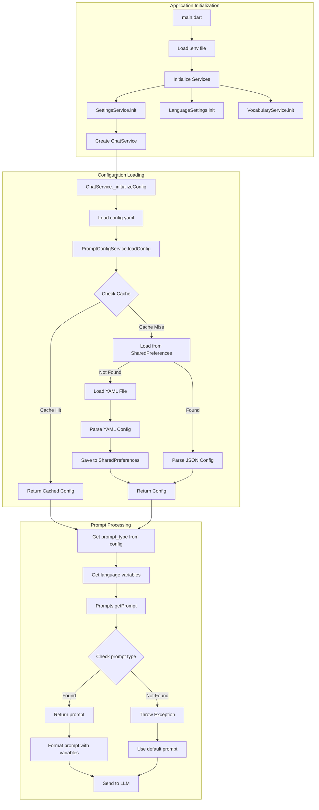

<!-- # Prompt Flow Diagram

This diagram shows how the application loads and processes prompts before sending them to the LLM.



## Initialization Flow

1. **Application Start** (`lib/main.dart`)
   - Load `.env` file for API keys
   - Initialize core services:
     - `SettingsService`
     - `LanguageSettings`
     - `VocabularyService`
   - Create `ChatService` with `SettingsService`

2. **Configuration Loading** (`lib/services/prompt_config_service.dart`)
   - `config.yaml` → `lib/config/config.yaml`
   - Cache check → `_config != null`
   - SharedPreferences → `_prefs.getString(_configKey)`
   - YAML loading → `rootBundle.loadString`
   - Config saving → `_saveConfig()`

3. **Prompt Processing**
   - ChatService → `lib/services/chat_service.dart`
     - Config initialization → `_initializeConfig()`
     - Prompt type → `_config?.systemPromptType`
     - Language variables → `defaultSettings` map
   - Prompts → `lib/services/prompts.dart`
     - Prompt lookup → `_promptMap[type.toLowerCase()]`
     - Variable formatting → `formatPromptWithVariables`
     - LLM sending → `_geminiModel.generateContent`

## Variables and Types

1. **Configuration Variables** (from `config.yaml`)
   - `target_language` (default: 'it')
   - `native_language` (default: 'en')
   - `support_language_1` (default: 'es')
   - `support_language_2` (default: 'fr')

2. **Available Prompt Types** (in `lib/services/prompts.dart`)
   - `fixed_prompt` (default language learning format)
   - `defaultSystemPrompt` (basic language learning format)
   - `qwen_1` (detailed translation format)
   - `example` (variable-based format)  -->
```
