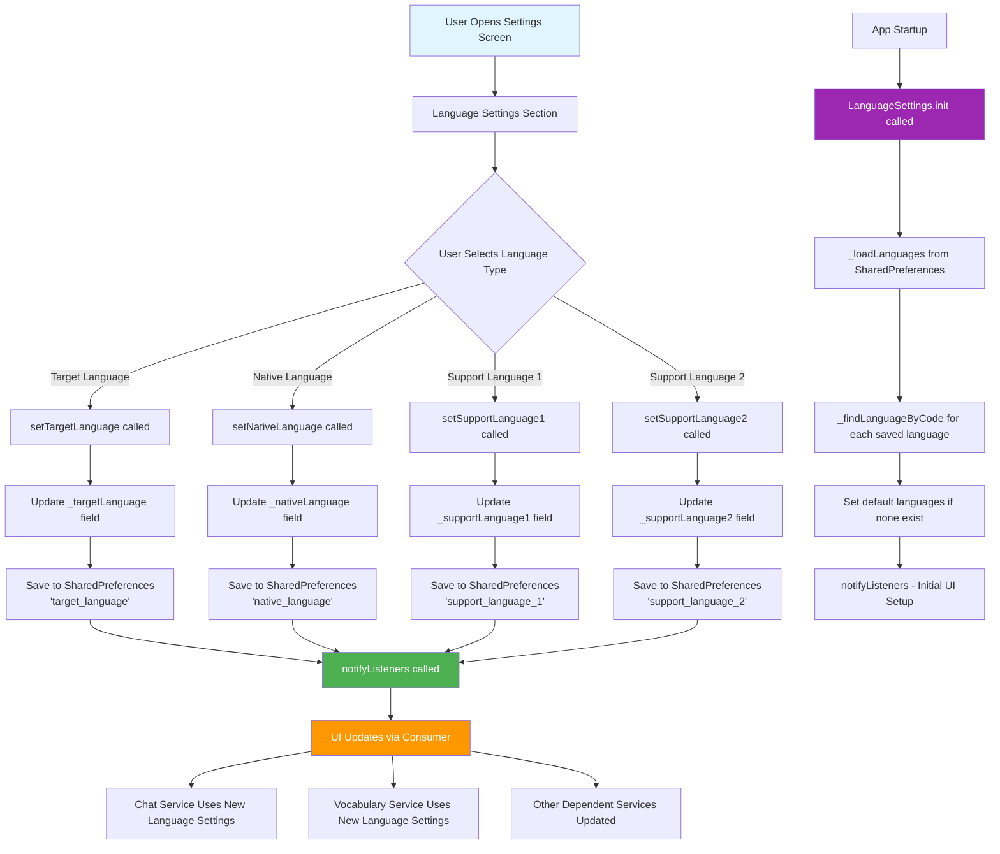

# Language Change Flow Diagram

This diagram shows how language changes are updated in the Flutter translation application.

## Key Components

- **LanguageSettings** (`lib/services/language_settings_service.dart:11`) - Core service managing language state
- **SettingsScreen** (`lib/screens/settings_screen.dart:63`) - UI for language selection
- **SharedPreferences** - Persistent storage for language preferences

## Flow Process

1. User interaction triggers setter methods (lines 93-123 in language_settings_service.dart)
2. Language codes are persisted to SharedPreferences
3. `notifyListeners()` updates all UI consumers
4. Dependent services (ChatService, VocabularyService) receive the changes
5. On app startup, preferences are loaded via `init()` method (line 48)

The system uses Flutter's Provider pattern with `ChangeNotifier` to propagate language changes throughout the application.