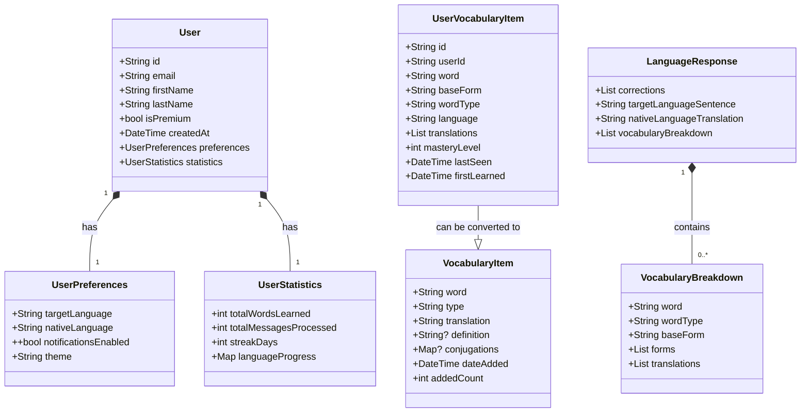

```mermaid
classDiagram
    class User {
        +String id
        +String email
        +String firstName
        +String lastName
        +bool isPremium
        +DateTime createdAt
        +UserPreferences preferences
        +UserStatistics statistics
    }

    class UserPreferences {
        +String targetLanguage
        +String nativeLanguage
        ++bool notificationsEnabled
        +String theme
    }

    class UserStatistics {
        +int totalWordsLearned
        +int totalMessagesProcessed
        +int streakDays
        +Map<String, int> languageProgress
    }

    class UserVocabularyItem {
        +String id
        +String userId
        +String word
        +String baseForm
        +String wordType
        +String language
        +List<String> translations
        +int masteryLevel
        +DateTime lastSeen
        +DateTime firstLearned
    }

    class VocabularyItem {
        +String word
        +String type
        +String translation
        +String? definition
        +Map<String, dynamic>? conjugations
        +DateTime dateAdded
        +int addedCount
    }

    class LanguageResponse {
        +List<String> corrections
        +String targetLanguageSentence
        +String nativeLanguageTranslation
        +List<VocabularyBreakdown> vocabularyBreakdown
    }

    class VocabularyBreakdown {
        +String word
        +String wordType
        +String baseForm
        +List<String> forms
        +List<String> translations
    }

    User "1" *-- "1" UserPreferences : has
    User "1" *-- "1" UserStatistics : has
    UserVocabularyItem --|> VocabularyItem : can be converted to
    LanguageResponse "1" *-- "0..*" VocabularyBreakdown : contains
```
